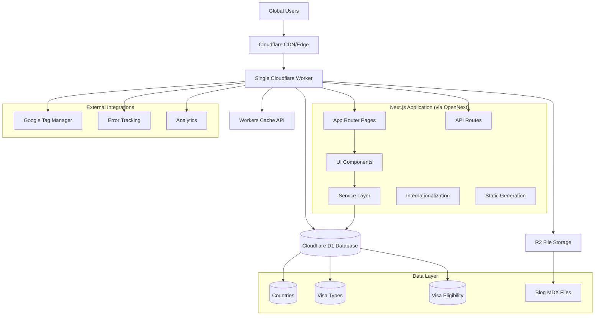
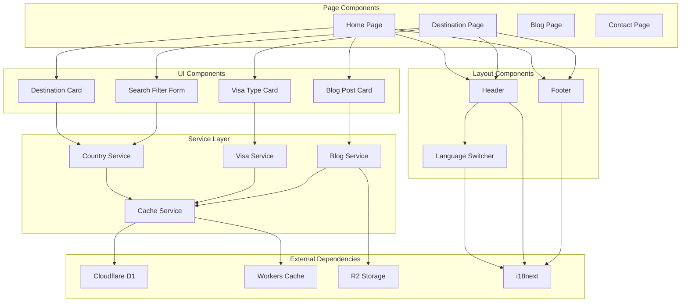
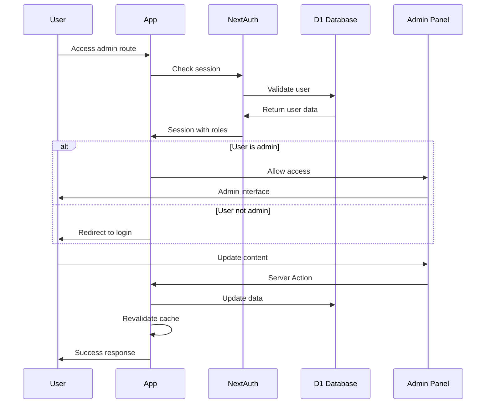

# GetTravelVisa.com Fullstack Architecture Document

This document outlines the complete fullstack architecture for GetTravelVisa.com, including backend systems, frontend implementation, and their integration. It serves as the single source of truth for AI-driven development, ensuring consistency across the entire technology stack.

This unified approach combines what would traditionally be separate backend and frontend architecture documents, streamlining the development process for modern fullstack applications where these concerns are increasingly intertwined.

## Starter Template Analysis

**Assessment**: Greenfield project with custom architecture

The GetTravelVisa.com platform was built from scratch using Next.js 15 with App Router, specifically architected for Cloudflare deployment via OpenNext.js. While not based on a starter template, it follows modern Next.js best practices with:

- Custom internationalization setup (i18next with 8 languages)
- Custom Drizzle ORM schema for visa/destination data
- Tailored Cloudflare Workers optimization
- Custom UI component library with Tailwind CSS

**Architectural Constraints**:

- Must maintain Cloudflare Worker execution limits (<50ms)
- Must support RTL languages with proper layout mirroring
- Database performance critical due to N+1 query issues identified in Story 1.8

## Change Log

| Date       | Version | Description                             | Author                     |
| ---------- | ------- | --------------------------------------- | -------------------------- |
| 2025-01-13 | v1.0    | Initial fullstack architecture document | Winston (System Architect) |

---

## High Level Architecture

### Technical Summary

GetTravelVisa.com employs a **serverless-first architecture** optimized for Cloudflare's edge computing platform, combining Next.js App Router with Cloudflare Workers for sub-50ms response times. The system integrates a **multilingual destination-driven catalog** with sophisticated visa eligibility matching, leveraging D1 SQLite for performant queries and Workers Cache API for aggressive optimization. The architecture prioritizes **single-query patterns** to eliminate N+1 database issues, ensuring consistent performance across 8 supported languages while maintaining RTL layout support. All components are designed for **edge-first deployment** via OpenNext.js, enabling global scale with Cloudflare's CDN infrastructure.

### Platform and Infrastructure Choice

**Platform:** Cloudflare Workers + Edge Infrastructure  
**Key Services:**

- Cloudflare Workers (compute)
- Cloudflare D1 (SQLite database)
- Cloudflare R2 (file storage)
- Cloudflare CDN (global distribution)
- Cloudflare Cache API (performance optimization)

**Deployment Host and Regions:** Global edge deployment via Cloudflare's 200+ data centers

### Repository Structure

**Structure:** Single Next.js application with modular organization  
**Monorepo Tool:** N/A - Single application repository  
**Package Organization:**

- Unified Next.js app with clear domain separation
- Service layer modules within `/lib/services/`
- Shared components in `/components/`
- Internationalization integrated throughout
- Database schema and utilities in `/lib/db/`

### High Level Architecture Diagram



### Architectural Patterns

- **Single Application Architecture:** Unified Next.js app deployed as one Cloudflare Worker - _Rationale:_ Simplifies deployment and reduces cold start overhead
- **OpenNext.js Deployment Pattern:** Transforms Next.js for Cloudflare Workers compatibility - _Rationale:_ Enables Next.js features while meeting Worker constraints
- **Edge-First Rendering:** All computation happens at Cloudflare edge - _Rationale:_ Addresses performance requirements and provides global scale
- **Single-Query Database Pattern:** Eliminate N+1 queries through JOIN operations - _Rationale:_ Critical for staying within Worker execution limits
- **Integrated Caching Strategy:** Workers Cache API + Next.js cache working together - _Rationale:_ Reduces database load and improves response times
- **Service Layer Pattern:** Clear separation between UI components and data access - _Rationale:_ Maintains clean architecture within single application

---

## Tech Stack

This is the DEFINITIVE technology selection for the entire project. This table serves as the single source of truth - all development must use these exact versions.

### Technology Stack Table

| Category              | Technology                         | Version      | Purpose                                       | Rationale                                                                                      |
| --------------------- | ---------------------------------- | ------------ | --------------------------------------------- | ---------------------------------------------------------------------------------------------- |
| Frontend Language     | TypeScript                         | 5.6+         | Type-safe development with strict mode        | Provides compile-time safety and better developer experience for complex visa logic            |
| Frontend Framework    | Next.js                            | 15.4.7+      | App Router with Turbopack development         | Latest version with App Router for optimal Cloudflare Workers compatibility                    |
| UI Component Library  | shadcn/ui                          | Latest       | Modern component library with MCP integration | Leverages shadcn registry for rapid development, excellent TypeScript support, customizable    |
| State Management      | React Built-in                     | 19.1.1+      | useState, useContext, server state            | Simple state needs don't require external library; server components handle most state         |
| Backend Language      | TypeScript                         | 5.6+         | Unified language across stack                 | Single language reduces complexity and enables shared types                                    |
| Backend Framework     | Next.js Server Actions             | 15.4.7+      | Type-safe server functions                    | Server Actions provide type-safe RPC-style API, optimized for Cloudflare Workers               |
| API Style             | Server Actions                     | Built-in     | Type-safe server-side functions               | Eliminates need for REST endpoints, provides automatic type safety and better DX               |
| Database              | Cloudflare D1                      | Latest       | SQLite-compatible edge database               | Edge deployment, automatic replication, integrates with Cloudflare ecosystem                   |
| ORM                   | Drizzle ORM                        | 0.44.5+      | Type-safe database operations                 | Best TypeScript integration, optimized for edge databases, excellent migration system          |
| Cache                 | Cloudflare Workers Cache + Next.js | Built-in     | Multi-layer caching strategy                  | Workers Cache for API responses, Next.js cache for static content                              |
| File Storage          | Cloudflare R2                      | Latest       | Object storage for images and MDX             | S3-compatible, integrates with CDN, cost-effective for global distribution                     |
| Authentication        | NextAuth.js                        | v5 (Auth.js) | Modern authentication solution                | Latest version with improved TypeScript support, edge-compatible, excellent provider ecosystem |
| Frontend Testing      | Jest + React Testing Library       | 29+          | Component and service testing                 | Industry standard, excellent TypeScript support, focuses on user behavior                      |
| Backend Testing       | Jest + Supertest                   | 29+          | Server Actions and database testing           | Same framework as frontend, enables shared test utilities                                      |
| E2E Testing           | Playwright                         | 1.40+        | Cross-browser automated testing               | Best performance on CI, excellent debugging, supports internationalization testing             |
| Build Tool            | Next.js + OpenNext                 | 1.8.0+       | Cloudflare Workers build pipeline             | Transforms Next.js for Workers compatibility while preserving features                         |
| Bundler               | Turbopack                          | Built-in     | Fast development builds                       | Integrated with Next.js 15, significantly faster than Webpack for development                  |
| IaC Tool              | Wrangler                           | 3.x          | Cloudflare infrastructure management          | Official Cloudflare tool, manages Workers, D1, R2, and deployments                             |
| CI/CD                 | GitHub Actions                     | Latest       | Automated testing and deployment              | Free for public repos, excellent integration with Cloudflare via Wrangler                      |
| Monitoring            | Sentry                             | 8.x          | Error tracking and performance                | Industry standard, excellent Next.js integration, performance insights                         |
| Logging               | Cloudflare Analytics + Console     | Built-in     | Request logging and debugging                 | Integrated with Workers, sufficient for current needs                                          |
| CSS Framework         | Tailwind CSS                       | 4.1.13+      | Utility-first styling with RTL support        | Excellent RTL support, consistent design system, optimized for performance                     |
| Font System           | Google Fonts (Cairo)               | Latest       | Multilingual typography support               | Supports Arabic, Latin scripts with consistent rendering across languages                      |
| Internationalization  | i18next                            | 25.5.2+      | 8-language support with routing               | Mature solution, excellent Next.js integration, supports complex pluralization                 |
| Component Development | shadcn/ui MCP + Registry           | Latest       | Rapid component development and sharing       | MCP integration enables AI-assisted development, registry provides proven components           |

---

## Data Models

### Country

**Purpose:** Represents both destination countries and passport-issuing countries, supporting multilingual content and comprehensive metadata for visa processing.

**Key Attributes:**

- `id`: string (primary key) - Unique identifier
- `code`: string - ISO country code (e.g., 'US', 'AE', 'FR')
- `name`: string - English country name
- `continent`: string - Geographic continent
- `region`: string - Geographic region/subregion
- `capital`: string - Capital city
- `currency`: string - Primary currency code
- `languages`: string[] - Spoken languages
- `heroImage`: string - Main country image URL
- `flagImage`: string - Country flag image URL
- `isActive`: boolean - Whether country is available for visa processing
- `isPopular`: boolean - Featured in popular destinations
- `deletedAt`: Date | null - Soft delete timestamp

**TypeScript Interface:**

```typescript
interface Country {
  id: string;
  code: string;
  name: string;
  continent: string;
  region: string;
  capital: string;
  currency: string;
  languages: string[];
  heroImage: string;
  flagImage: string;
  isActive: boolean;
  isPopular: boolean;
  createdAt: Date;
  updatedAt: Date;
  deletedAt: Date | null;
}

interface CountryI18n {
  id: string;
  countryId: string;
  locale: string;
  name: string;
  about: string;
  createdAt: Date;
  updatedAt: Date;
}
```

**Relationships:**

- One-to-many with CountryI18n (localized content)
- One-to-many with VisaType (destination country)
- One-to-many with VisaEligibility (both passport and destination)

### VisaType

**Purpose:** Defines available visa options for each destination country with detailed application requirements and processing information.

**Key Attributes:**

- `id`: string (primary key) - Unique identifier
- `destinationId`: string - Reference to destination country
- `name`: string - Visa type name (e.g., 'Tourist Visa', 'Business Visa')
- `description`: string - Detailed visa description
- `processingTime`: number - Processing time in days
- `fee`: number - Application fee amount
- `currency`: string - Fee currency
- `validity`: number - Visa validity in days
- `stayDuration`: number - Maximum stay duration in days
- `entryType`: enum - 'single' | 'multiple' | 'transit'
- `category`: string - Visa category classification
- `requirements`: string[] - Required documents and conditions
- `isActive`: boolean - Whether visa type is available
- `isPopular`: boolean - Featured visa option

**TypeScript Interface:**

```typescript
interface VisaType {
  id: string;
  destinationId: string;
  name: string;
  description: string;
  processingTime: number;
  fee: number;
  currency: string;
  validity: number;
  stayDuration: number;
  entryType: "single" | "multiple" | "transit";
  category: string;
  requirements: string[];
  isActive: boolean;
  isPopular: boolean;
  createdAt: Date;
  updatedAt: Date;
  deletedAt: Date | null;
}

interface VisaTypeI18n {
  id: string;
  visaTypeId: string;
  locale: string;
  name: string;
  description: string;
  requirements: string[];
  createdAt: Date;
  updatedAt: Date;
}
```

**Relationships:**

- Many-to-one with Country (destination)
- One-to-many with VisaEligibility
- One-to-many with VisaTypeI18n (localized content)

### VisaEligibility

**Purpose:** Defines many-to-many relationships between passport countries, destination countries, and visa types, enabling complex eligibility calculations.

**Key Attributes:**

- `id`: string (primary key) - Unique identifier
- `passportCountryId`: string - Passport issuing country
- `destinationId`: string - Destination country
- `visaTypeId`: string - Specific visa type
- `eligibilityStatus`: enum - 'visa_free' | 'visa_on_arrival' | 'visa_required' | 'not_allowed'
- `maxStayDays`: number | null - Maximum stay without visa (for visa-free)
- `notes`: string | null - Additional eligibility notes
- `isActive`: boolean - Whether eligibility rule is active

**TypeScript Interface:**

```typescript
interface VisaEligibility {
  id: string;
  passportCountryId: string;
  destinationId: string;
  visaTypeId: string;
  eligibilityStatus:
    | "visa_free"
    | "visa_on_arrival"
    | "visa_required"
    | "not_allowed";
  maxStayDays: number | null;
  notes: string | null;
  isActive: boolean;
  createdAt: Date;
  updatedAt: Date;
  deletedAt: Date | null;
}
```

**Relationships:**

- Many-to-one with Country (passport country)
- Many-to-one with Country (destination country)
- Many-to-one with VisaType

### BlogPost

**Purpose:** Supports destination-focused travel blog content with multilingual support and comprehensive metadata for SEO optimization.

**Key Attributes:**

- `slug`: string (primary key) - URL-friendly identifier
- `title`: string - Blog post title
- `description`: string - Meta description
- `content`: string - MDX content
- `destination`: string | null - Associated destination country code
- `passport`: string | null - Relevant passport country
- `relatedVisas`: string[] - Related visa type IDs
- `tags`: string[] - Content tags for categorization
- `image`: string - Featured image URL
- `publishedAt`: Date - Publication date
- `locale`: string - Content language
- `isPublished`: boolean - Publication status

**TypeScript Interface:**

```typescript
interface BlogPost {
  slug: string;
  title: string;
  description: string;
  content: string;
  destination: string | null;
  passport: string | null;
  relatedVisas: string[];
  tags: string[];
  image: string;
  publishedAt: Date;
  locale: string;
  isPublished: boolean;
  createdAt: Date;
  updatedAt: Date;
}
```

**Relationships:**

- Many-to-one with Country (destination, optional)
- Many-to-one with Country (passport, optional)
- Many-to-many with VisaType (via relatedVisas array)

---

## API Specification

Based on SEO-first architecture, data retrieval uses Next.js rendering strategies (SSG/ISR/SSR) while Server Actions handle mutations (POST/PUT/DELETE operations).

### Data Retrieval Strategy (GET Operations)

**SSG/ISR/SSR Functions for SEO-Optimized Data Fetching:**

```typescript
// Static Site Generation for Popular Destinations (Homepage)
export async function getStaticProps() {
  const destinations = await countryService.getPopularDestinations("en");
  const blogPosts = await blogService.getLatestBlogPosts("en", 3);

  return {
    props: {
      destinations,
      blogPosts,
    },
    revalidate: 3600, // 1 hour ISR
  };
}

// Static Generation with ISR for Destination Pages
export async function generateStaticParams() {
  const countries = await countryService.getAllCountryCodes();
  return countries.map(code => ({ destination: code }));
}

export async function getDestinationData(
  destinationCode: string,
  locale: string
) {
  // This runs at build time (SSG) or request time (ISR)
  const destination = await countryService.getDestinationWithVisaOptions({
    destinationCode,
    locale,
  });

  const relatedBlogPosts = await blogService.getBlogPostsByDestination(
    destinationCode,
    locale,
    5
  );

  return {
    destination,
    relatedBlogPosts,
    lastModified: new Date().toISOString(),
  };
}

// Server-Side Rendering for Dynamic Content (Search Results)
export async function getServerSideProps(context: GetServerSidePropsContext) {
  const { passport, destination, search } = context.query;

  if (passport && destination) {
    // Dynamic visa eligibility checking
    const eligibility = await visaService.checkEligibility({
      passportCountry: passport as string,
      destinationCountry: destination as string,
      locale: context.locale || "en",
    });

    return {
      props: { eligibility },
    };
  }

  // Search results
  if (search) {
    const results = await countryService.searchDestinations({
      query: search as string,
      locale: context.locale || "en",
    });

    return {
      props: { searchResults: results },
    };
  }

  return { props: {} };
}
```

### Server Actions for Mutations (POST/PUT/DELETE)

```typescript
"use server";

import { z } from "zod";
import { revalidateTag, revalidatePath } from "next/cache";

// Newsletter Subscription
export async function subscribeToNewsletter(formData: FormData) {
  const schema = z.object({
    email: z.string().email(),
    locale: z.string().optional().default("en"),
  });

  const email = formData.get("email") as string;
  const locale = formData.get("locale") as string;

  const { email: validEmail, locale: validLocale } = schema.parse({
    email,
    locale,
  });

  try {
    // Add to newsletter service
    await newsletterService.subscribe(validEmail, validLocale);

    return { success: true, message: "Subscribed successfully" };
  } catch (error) {
    return { success: false, error: "Subscription failed" };
  }
}

// Contact Form Submission
export async function submitContactForm(formData: FormData) {
  const schema = z.object({
    name: z.string().min(2).max(100),
    email: z.string().email(),
    phone: z.string().optional(),
    reason: z.enum(["question", "partnership", "other"]),
    subject: z.string().min(5).max(200),
    message: z.string().min(10).max(2000),
    locale: z.string().optional().default("en"),
  });

  const rawData = {
    name: formData.get("name") as string,
    email: formData.get("email") as string,
    phone: formData.get("phone") as string,
    reason: formData.get("reason") as string,
    subject: formData.get("subject") as string,
    message: formData.get("message") as string,
    locale: formData.get("locale") as string,
  };

  const validData = schema.parse(rawData);

  try {
    await contactService.submitMessage(validData);

    return { success: true, message: "Message sent successfully" };
  } catch (error) {
    return { success: false, error: "Failed to send message" };
  }
}

// Admin Content Management Actions
export async function updateDestinationContent(formData: FormData) {
  // Admin authentication check
  const session = await auth();
  if (!session?.user?.isAdmin) {
    throw new Error("Unauthorized");
  }

  const schema = z.object({
    destinationId: z.string(),
    locale: z.string(),
    name: z.string(),
    about: z.string(),
  });

  const data = {
    destinationId: formData.get("destinationId") as string,
    locale: formData.get("locale") as string,
    name: formData.get("name") as string,
    about: formData.get("about") as string,
  };

  const validData = schema.parse(data);

  try {
    await countryService.updateDestinationContent(validData);

    // Revalidate affected pages
    revalidateTag("destinations");
    revalidatePath(`/[locale]/d/${validData.destinationId}`);

    return { success: true, message: "Content updated successfully" };
  } catch (error) {
    return { success: false, error: "Failed to update content" };
  }
}
```

### SEO-Optimized Page Generation Strategy

```typescript
// app/[locale]/d/[destination]/page.tsx
export async function generateMetadata({ params }: PageProps) {
  const destination = await getDestinationData(params.destination, params.locale);

  return {
    title: `${destination.name} Visa Requirements | GetTravelVisa.com`,
    description: `Complete visa information for ${destination.name}. Check requirements, fees, and processing times for your passport.`,
    openGraph: {
      title: `${destination.name} Visa Guide`,
      description: destination.about,
      images: [destination.heroImage],
    },
    alternates: {
      canonical: `https://gettravelvisa.com/${params.locale}/d/${params.destination}`,
      languages: {
        'en': `https://gettravelvisa.com/en/d/${params.destination}`,
        'ar': `https://gettravelvisa.com/ar/d/${params.destination}`,
        'es': `https://gettravelvisa.com/es/d/${params.destination}`,
        // ... other languages
      }
    }
  };
}

// ISR Implementation
export const revalidate = 3600; // 1 hour

export default async function DestinationPage({ params }: PageProps) {
  const data = await getDestinationData(params.destination, params.locale);

  return <DestinationPageComponent {...data} />;
}
```

---

## Components

### Core Frontend Components

#### DestinationCard

**Responsibility:** Display destination country information with visa summary and navigation links

**Key Interfaces:**

- `DestinationCardProps` - country data, visa count, popularity metrics
- `OnDestinationClick` - navigation handler for destination details

**Dependencies:** Country data model, flag utility, routing system

**Technology Stack:** React with TypeScript, shadcn/ui Card component, Tailwind CSS with RTL support

```typescript
interface DestinationCardProps {
  country: Country;
  visaCount: number;
  popularityScore?: number;
  passportCountry?: string;
  locale: string;
  className?: string;
}
```

#### VisaTypeCard

**Responsibility:** Display individual visa type information with eligibility status and application details

**Key Interfaces:**

- `VisaTypeCardProps` - visa type data, eligibility, pricing
- `OnApplyClick` - application action handler

**Dependencies:** VisaType data model, eligibility service, currency formatting

**Technology Stack:** shadcn/ui components, dynamic pricing display, conditional rendering

#### SearchFilterForm

**Responsibility:** Handle destination search and passport-based filtering with real-time results

**Key Interfaces:**

- `SearchFormProps` - initial values, callback handlers
- `OnSearchSubmit` - search query processing
- `OnFilterChange` - real-time filter updates

**Dependencies:** Country service, debounced search, form validation

**Technology Stack:** React Hook Form, shadcn/ui Select and Input components, Zod validation

#### BlogPostCard

**Responsibility:** Display blog post previews with destination context and related visa information

**Key Interfaces:**

- `BlogPostCardProps` - post metadata, destination links
- `OnPostClick` - navigation to full post

**Dependencies:** BlogPost data model, image optimization, reading time calculation

**Technology Stack:** Next.js Image, MDX excerpt parsing, date formatting utilities

### Layout Components

#### Header

**Responsibility:** Global navigation with language switching, responsive menu, and search integration

**Key Interfaces:**

- `HeaderProps` - current locale, user preferences
- `LanguageSwitchHandler` - locale change processing
- `NavigationHandler` - route management

**Dependencies:** i18next, Next.js router, user session state

**Technology Stack:** shadcn/ui Navigation Menu, responsive design patterns, RTL layout support

#### Footer

**Responsibility:** Site-wide footer with multi-column layout, legal links, and social media integration

**Key Interfaces:**

- `FooterProps` - locale, site configuration
- `SocialLinks` - external link management

**Dependencies:** Static content, social media URLs, legal page routing

**Technology Stack:** Responsive grid layout, external link handling, accessibility features

#### LanguageSwitcher

**Responsibility:** Dropdown language selection with proper URL handling and state persistence

**Key Interfaces:**

- `LanguageSwitcherProps` - current locale, available languages
- `OnLanguageChange` - locale switching logic

**Dependencies:** Routing system, locale persistence, URL generation

**Technology Stack:** shadcn/ui Select, locale-aware routing, cookie management

### Service Layer Components

#### CountryService

**Responsibility:** Database operations for country data, destination details, and popularity calculations

**Key Interfaces:**

- `getPopularDestinations()` - optimized query for homepage
- `getDestinationWithVisaOptions()` - detailed destination data
- `getAllDestinations()` - paginated country listing with filters

**Dependencies:** Drizzle ORM, D1 database connection, caching layer

**Technology Stack:** Single-query optimization, JOIN operations, performance monitoring

```typescript
class CountryService {
  async getPopularDestinations(locale: string): Promise<DestinationSummary[]> {
    // Single optimized query with JOINs to avoid N+1 pattern
    return await db
      .select({
        id: countries.id,
        code: countries.code,
        name: countriesI18n.name,
        heroImage: countries.heroImage,
        visaCount: sql<number>`count(distinct ${visaTypes.id})`,
        avgProcessingTime: sql<number>`avg(${visaTypes.processingTime})`,
        minFee: sql<number>`min(${visaTypes.fee})`,
      })
      .from(countries)
      .leftJoin(countriesI18n, eq(countriesI18n.countryId, countries.id))
      .leftJoin(visaTypes, eq(visaTypes.destinationId, countries.id))
      .where(
        and(
          eq(countries.isActive, true),
          eq(countries.isPopular, true),
          eq(countriesI18n.locale, locale)
        )
      )
      .groupBy(countries.id)
      .orderBy(desc(countries.popularityScore))
      .limit(8);
  }
}
```

#### VisaService

**Responsibility:** Visa eligibility calculations, application requirements, and processing information

**Key Interfaces:**

- `checkEligibility()` - passport-destination visa requirements
- `getVisaTypeDetails()` - comprehensive visa information
- `calculateVisaFees()` - pricing with currency conversion

**Dependencies:** Database models, eligibility rules, external rate APIs

**Technology Stack:** Complex eligibility logic, fee calculations, requirement validation

#### BlogService

**Responsibility:** MDX content processing, destination-related posts, and tag-based filtering

**Key Interfaces:**

- `getBlogPosts()` - paginated post listing with filters
- `getBlogPost()` - individual post with metadata
- `getRelatedPosts()` - content recommendation engine

**Dependencies:** File system access, MDX parsing, content validation

**Technology Stack:** gray-matter, remark-gfm, content caching, image optimization

### Performance-Critical Components

#### CachedDestinationData

**Responsibility:** Aggressive caching wrapper for expensive destination queries

**Key Interfaces:**

- `getCachedData()` - cache-first data retrieval
- `invalidateCache()` - selective cache clearing

**Dependencies:** Cloudflare Workers Cache API, Next.js cache, revalidation triggers

**Technology Stack:** Multi-layer caching, TTL management, cache invalidation patterns

#### OptimizedImageGallery

**Responsibility:** Destination image gallery with lazy loading and performance optimization

**Key Interfaces:**

- `ImageGalleryProps` - image URLs, alt text, optimization settings
- `OnImageLoad` - progressive loading handlers

**Dependencies:** Cloudflare Image Optimization, Next.js Image component

**Technology Stack:** WebP conversion, responsive images, lazy loading, blur placeholders

### Component Diagrams



---

## Frontend Architecture

### Component Architecture

#### Component Organization

```
src/
├── components/
│   ├── ui/                          # shadcn/ui components (migrating to)
│   │   ├── button.tsx
│   │   ├── card.tsx
│   │   ├── select.tsx
│   │   ├── input.tsx
│   │   └── navigation-menu.tsx
│   ├── layout/                      # Layout-specific components
│   │   ├── header.tsx
│   │   ├── footer.tsx
│   │   └── language-switcher.tsx
│   ├── destinations/                # Domain-specific components
│   │   ├── destination-card.tsx
│   │   ├── visa-type-card.tsx
│   │   ├── search-filter-form.tsx
│   │   └── destinations-grid.tsx
│   ├── blog/                        # Blog-related components
│   │   ├── blog-post-card.tsx
│   │   ├── blog-post-list.tsx
│   │   └── related-articles.tsx
│   ├── forms/                       # Form components
│   │   ├── contact-form.tsx
│   │   ├── newsletter-form.tsx
│   │   └── search-form.tsx
│   └── common/                      # Reusable components
│       ├── loading-spinner.tsx
│       ├── error-boundary.tsx
│       └── seo-meta.tsx
```

#### Component Template (shadcn/ui Pattern)

```typescript
// components/destinations/destination-card.tsx
import { Card, CardContent, CardHeader, CardTitle } from "@/components/ui/card"
import { Badge } from "@/components/ui/badge"
import { Button } from "@/components/ui/button"
import { MapPin, Clock, DollarSign } from "lucide-react"
import Image from "next/image"
import Link from "next/link"
import { cn } from "@/lib/utils"
import type { Country } from "@/lib/types"

interface DestinationCardProps {
  country: Country & {
    visaCount: number;
    avgProcessingTime: number;
    minFee: number;
  };
  locale: string;
  passportCountry?: string;
  className?: string;
}

export function DestinationCard({
  country,
  locale,
  passportCountry,
  className
}: DestinationCardProps) {
  return (
    <Card className={cn(
      "group overflow-hidden transition-all duration-300 hover:shadow-lg",
      "rtl:text-right ltr:text-left", // RTL support
      className
    )}>
      <div className="relative h-48 overflow-hidden">
        <Image
          src={country.heroImage}
          alt={country.name}
          fill
          className="object-cover transition-transform group-hover:scale-105"
          sizes="(max-width: 768px) 100vw, (max-width: 1200px) 50vw, 33vw"
        />
        {country.isPopular && (
          <Badge className="absolute top-2 ltr:right-2 rtl:left-2">
            Popular
          </Badge>
        )}
      </div>

      <CardHeader>
        <CardTitle className="flex items-center gap-2">
          <Image
            src={country.flagImage}
            alt={`${country.name} flag`}
            width={24}
            height={16}
            className="rounded-sm"
          />
          {country.name}
        </CardTitle>
      </CardHeader>

      <CardContent className="space-y-4">
        <div className="grid grid-cols-3 gap-2 text-sm text-muted-foreground">
          <div className="flex items-center gap-1">
            <MapPin className="h-4 w-4" />
            <span>{country.visaCount} visas</span>
          </div>
          <div className="flex items-center gap-1">
            <Clock className="h-4 w-4" />
            <span>{country.avgProcessingTime}d</span>
          </div>
          <div className="flex items-center gap-1">
            <DollarSign className="h-4 w-4" />
            <span>From ${country.minFee}</span>
          </div>
        </div>

        <Button asChild className="w-full">
          <Link href={`/${locale}/d/${country.code}`}>
            View Requirements
          </Link>
        </Button>
      </CardContent>
    </Card>
  )
}
```

### State Management Architecture

#### State Structure

```typescript
// lib/types/state.ts
interface AppState {
  // User preferences (stored in cookies/localStorage)
  userPreferences: {
    passportCountry?: string;
    preferredLanguage: string;
    currency: string;
    recentSearches: string[];
  };

  // Search state (URL-based, no global state needed)
  searchFilters: {
    query?: string;
    passport?: string;
    destination?: string;
    continent?: string;
    visaType?: string;
  };

  // UI state (component-local)
  ui: {
    sidebarOpen: boolean;
    searchModalOpen: boolean;
    languageDropdownOpen: boolean;
  };
}

// State management patterns
interface StateManagementPatterns {
  // Server state - handled by Next.js SSG/ISR/SSR
  serverState: "Next.js data fetching";

  // Client state - React built-in hooks
  clientState: "useState + useContext for shared state";

  // URL state - Next.js router
  urlState: "useSearchParams + useRouter";

  // Persistent state - cookies and localStorage
  persistentState: "js-cookie + localStorage utilities";
}
```

#### State Management Patterns

- **Server State via SSG/ISR**: All destination and visa data fetched at build/request time
- **Component State via useState**: Local UI interactions and form state
- **Shared State via useContext**: User preferences and global UI state
- **URL State via Next.js Router**: Search filters and pagination state
- **Persistent State via Cookies**: Language preferences and user settings

### Routing Architecture

#### Route Organization

```
app/
├── [locale]/                        # Internationalized routes
│   ├── page.tsx                     # Homepage
│   ├── layout.tsx                   # Locale-specific layout
│   ├── loading.tsx                  # Global loading UI
│   ├── error.tsx                    # Error boundary
│   ├── not-found.tsx               # 404 page
│   ├── contact/
│   │   └── page.tsx                 # Contact form
│   ├── blog/
│   │   ├── page.tsx                 # Blog listing
│   │   ├── [slug]/
│   │   │   └── page.tsx             # Individual blog post
│   │   ├── t/
│   │   │   └── [tag]/
│   │   │       └── page.tsx         # Tag-filtered posts
│   │   └── sitemap.ts               # Blog sitemap
│   ├── d/                           # Destinations
│   │   ├── page.tsx                 # All destinations
│   │   ├── [destination]/
│   │   │   ├── page.tsx             # Destination details
│   │   │   ├── blog/
│   │   │   │   └── page.tsx         # Destination blog posts
│   │   │   ├── v/
│   │   │   │   └── [visa]/
│   │   │   │       └── page.tsx     # Visa details
│   │   │   └── p/
│   │   │       └── [passport]/
│   │   │           └── page.tsx     # Passport-specific eligibility
│   │   └── sitemap.ts               # Destinations sitemap
│   └── p/                           # Static pages
│       ├── [slug]/
│       │   └── page.tsx             # Terms, Privacy, About, etc.
├── api/                             # API routes (minimal usage)
│   └── revalidate/
│       └── route.ts                 # ISR revalidation webhook
├── globals.css                      # Global styles
├── layout.tsx                       # Root layout
├── loading.tsx                      # Root loading
├── not-found.tsx                   # Root 404
└── sitemap.ts                      # Main sitemap
```

#### Protected Route Pattern

```typescript
// lib/auth/route-protection.tsx
import { auth } from "@/lib/auth"
import { redirect } from "next/navigation"

interface ProtectedRouteProps {
  children: React.ReactNode;
  requireAdmin?: boolean;
  fallbackUrl?: string;
}

export async function ProtectedRoute({
  children,
  requireAdmin = false,
  fallbackUrl = "/login"
}: ProtectedRouteProps) {
  const session = await auth()

  if (!session) {
    redirect(fallbackUrl)
  }

  if (requireAdmin && !session.user.isAdmin) {
    redirect("/unauthorized")
  }

  return <>{children}</>
}

// Usage in admin pages
export default async function AdminPage() {
  return (
    <ProtectedRoute requireAdmin>
      <AdminDashboard />
    </ProtectedRoute>
  )
}
```

### Frontend Services Layer

#### API Client Setup

```typescript
// lib/api/client.ts
import { unstable_cache } from "next/cache";

// Cached data fetching for static/ISR pages
export const apiClient = {
  destinations: {
    getPopular: unstable_cache(
      async (locale: string) => {
        return await countryService.getPopularDestinations(locale);
      },
      ["popular-destinations"],
      { revalidate: 3600, tags: ["destinations"] }
    ),

    getAll: unstable_cache(
      async (params: GetDestinationsParams) => {
        return await countryService.getAllDestinations(params);
      },
      ["all-destinations"],
      { revalidate: 1800, tags: ["destinations"] }
    ),

    getDetails: unstable_cache(
      async (code: string, locale: string) => {
        return await countryService.getDestinationDetails(code, locale);
      },
      ["destination-details"],
      { revalidate: 3600, tags: ["destination"] }
    ),
  },

  visas: {
    checkEligibility: async (params: EligibilityParams) => {
      // Dynamic eligibility checking (SSR)
      return await visaService.checkEligibility(params);
    },
  },

  blog: {
    getPosts: unstable_cache(
      async (params: GetBlogPostsParams) => {
        return await blogService.getBlogPosts(params);
      },
      ["blog-posts"],
      { revalidate: 1800, tags: ["blog"] }
    ),
  },
};
```

#### Service Example

```typescript
// lib/hooks/use-search.ts
import { useState, useEffect, useMemo } from "react";
import { useSearchParams, useRouter } from "next/navigation";
import { useDebounce } from "./use-debounce";

interface UseSearchProps {
  locale: string;
  onResults?: (results: SearchResult[]) => void;
}

export function useSearch({ locale, onResults }: UseSearchProps) {
  const router = useRouter();
  const searchParams = useSearchParams();
  const [query, setQuery] = useState(searchParams.get("q") || "");
  const [isLoading, setIsLoading] = useState(false);
  const [results, setResults] = useState<SearchResult[]>([]);

  const debouncedQuery = useDebounce(query, 300);

  // Update URL when query changes
  useEffect(() => {
    const params = new URLSearchParams(searchParams.toString());
    if (debouncedQuery) {
      params.set("q", debouncedQuery);
    } else {
      params.delete("q");
    }
    router.replace(`?${params.toString()}`, { scroll: false });
  }, [debouncedQuery, router, searchParams]);

  // Perform search when debounced query changes
  useEffect(() => {
    if (!debouncedQuery) {
      setResults([]);
      return;
    }

    setIsLoading(true);

    // Search implementation using Server Actions
    searchDestinations({ query: debouncedQuery, locale })
      .then(searchResults => {
        setResults(searchResults);
        onResults?.(searchResults);
      })
      .catch(error => {
        console.error("Search failed:", error);
        setResults([]);
      })
      .finally(() => {
        setIsLoading(false);
      });
  }, [debouncedQuery, locale, onResults]);

  return {
    query,
    setQuery,
    results,
    isLoading,
    hasQuery: Boolean(debouncedQuery),
  };
}
```

---

## Backend Architecture

### Serverless Function Architecture

#### Function Organization

```
src/
├── lib/
│   ├── services/                    # Core business logic
│   │   ├── country-service.ts       # Country/destination operations
│   │   ├── visa-service.ts          # Visa eligibility calculations
│   │   ├── blog-service.ts          # Content management
│   │   └── cache-service.ts         # Multi-layer caching
│   ├── db/                          # Database layer
│   │   ├── connection.ts            # D1 connection setup
│   │   ├── schema/                  # Drizzle schema definitions
│   │   └── migrations/              # Database migrations
│   ├── utils/                       # Utility functions
│   │   ├── performance.ts           # Execution time monitoring
│   │   ├── cache-keys.ts            # Cache key generation
│   │   └── query-optimization.ts    # Single-query patterns
│   └── actions/                     # Server Actions
│       ├── destination-actions.ts   # Destination-related mutations
│       ├── contact-actions.ts       # Contact form processing
│       └── admin-actions.ts         # Content management
```

#### Server Action Template (Performance-Optimized)

```typescript
// lib/actions/destination-actions.ts
"use server";

import { z } from "zod";
import { countryService } from "@/lib/services/country-service";
import { withPerformanceMonitoring } from "@/lib/utils/performance";
import { revalidateTag } from "next/cache";

const subscribeNewsletterSchema = z.object({
  email: z.string().email(),
  destination: z.string().optional(),
  locale: z.string().default("en"),
});

export const subscribeToNewsletter = withPerformanceMonitoring(
  "subscribeToNewsletter",
  async (formData: FormData) => {
    const startTime = performance.now();

    try {
      // Input validation (fast, happens first)
      const data = subscribeNewsletterSchema.parse({
        email: formData.get("email"),
        destination: formData.get("destination"),
        locale: formData.get("locale"),
      });

      // Single database operation
      await countryService.addNewsletterSubscription(data);

      // Optional: Track performance for monitoring
      const executionTime = performance.now() - startTime;
      if (executionTime > 30) {
        console.warn(`Slow Server Action: ${executionTime.toFixed(2)}ms`);
      }

      return { success: true, message: "Subscribed successfully" };
    } catch (error) {
      console.error("Newsletter subscription failed:", error);
      return { success: false, error: "Subscription failed" };
    }
  }
);
```

### Database Architecture

#### Optimized Schema Design (Addressing Story 1.8 N+1 Issues)

```sql
-- Optimized indexes for single-query patterns
CREATE INDEX idx_countries_popular_lookup
ON countries(isActive, isPopular, deletedAt)
WHERE isActive = true AND deletedAt IS NULL;

CREATE INDEX idx_countries_i18n_locale_lookup
ON countriesI18n(countryId, locale);

CREATE INDEX idx_visa_types_destination_active
ON visaTypes(destinationId, isActive, deletedAt, fee, processingTime)
WHERE isActive = true AND deletedAt IS NULL;

CREATE INDEX idx_visa_eligibility_comprehensive
ON visaEligibility(passportCountryId, destinationId, eligibilityStatus, isActive)
WHERE isActive = true AND deletedAt IS NULL;

-- Materialized view for popular destinations (pre-computed)
CREATE VIEW popular_destinations_summary AS
SELECT
  c.id,
  c.code,
  c.name,
  c.heroImage,
  c.continent,
  c.isPopular,
  ci.name as localizedName,
  ci.about,
  COUNT(DISTINCT vt.id) as visaCount,
  ROUND(AVG(vt.processingTime)) as avgProcessingTime,
  MIN(vt.fee) as minFee,
  COUNT(DISTINCT CASE WHEN ve.eligibilityStatus IN ('visa_free', 'on_arrival')
    THEN ve.passportCountryId END) as visaFreeCountries
FROM countries c
LEFT JOIN countriesI18n ci ON c.id = ci.countryId
LEFT JOIN visaTypes vt ON c.id = vt.destinationId
  AND vt.isActive = true AND vt.deletedAt IS NULL
LEFT JOIN visaEligibility ve ON c.id = ve.destinationId
  AND ve.isActive = true AND ve.deletedAt IS NULL
WHERE c.isActive = true AND c.deletedAt IS NULL
GROUP BY c.id, c.code, c.name, c.heroImage, c.continent, c.isPopular, ci.name, ci.about;
```

#### Data Access Layer (Single-Query Optimization)

```typescript
// lib/services/country-service.ts
import { db } from "@/lib/db/connection";
import {
  countries,
  countriesI18n,
  visaTypes,
  visaEligibility,
} from "@/lib/db/schema";
import { eq, and, desc, sql, count, avg, min } from "drizzle-orm";

export class CountryService {
  // Optimized single query for popular destinations
  async getPopularDestinations(locale: string): Promise<DestinationSummary[]> {
    const startTime = performance.now();

    try {
      // Single query with all needed data - eliminates N+1 pattern
      const results = await db
        .select({
          id: countries.id,
          code: countries.code,
          name: countries.name,
          localizedName: countriesI18n.name,
          heroImage: countries.heroImage,
          continent: countries.continent,
          isPopular: countries.isPopular,
          about: countriesI18n.about,
          // Aggregated visa information
          visaCount: count(visaTypes.id).as("visaCount"),
          avgProcessingTime:
            sql<number>`COALESCE(AVG(${visaTypes.processingTime}), 0)`.as(
              "avgProcessingTime"
            ),
          minFee: sql<number>`COALESCE(MIN(${visaTypes.fee}), 0)`.as("minFee"),
          // Visa-free options count
          visaFreeOptions:
            sql<number>`COUNT(CASE WHEN ${visaEligibility.eligibilityStatus} IN ('visa_free', 'on_arrival') THEN 1 END)`.as(
              "visaFreeOptions"
            ),
        })
        .from(countries)
        .leftJoin(
          countriesI18n,
          and(
            eq(countriesI18n.countryId, countries.id),
            eq(countriesI18n.locale, locale)
          )
        )
        .leftJoin(
          visaTypes,
          and(
            eq(visaTypes.destinationId, countries.id),
            eq(visaTypes.isActive, true),
            sql`${visaTypes.deletedAt} IS NULL`
          )
        )
        .leftJoin(
          visaEligibility,
          and(
            eq(visaEligibility.destinationId, countries.id),
            eq(visaEligibility.isActive, true),
            sql`${visaEligibility.deletedAt} IS NULL`
          )
        )
        .where(
          and(
            eq(countries.isActive, true),
            eq(countries.isPopular, true),
            sql`${countries.deletedAt} IS NULL`
          )
        )
        .groupBy(countries.id, countriesI18n.name, countriesI18n.about)
        .orderBy(desc(countries.popularityScore))
        .limit(8);

      const executionTime = performance.now() - startTime;

      // Performance monitoring for Story 1.8 compliance
      if (executionTime > 30) {
        console.warn(
          `Slow query detected: getPopularDestinations took ${executionTime.toFixed(2)}ms`
        );
      }

      return results.map(row => ({
        ...row,
        name: row.localizedName || row.name, // Fallback to English
        about: row.about || "", // Handle null descriptions
        executionTime: Math.round(executionTime),
      }));
    } catch (error) {
      console.error("Failed to fetch popular destinations:", error);
      throw new Error("Unable to load destinations");
    }
  }
}
```

### Authentication and Authorization

#### Auth Flow



#### Middleware/Guards

```typescript
// lib/auth/middleware.ts
import { auth } from "@/lib/auth";
import { NextResponse } from "next/server";

export async function authMiddleware(request: Request) {
  // Skip auth for public routes
  const publicRoutes = ["/", "/d", "/blog", "/contact"];
  const pathname = new URL(request.url).pathname;

  if (publicRoutes.some(route => pathname.startsWith(route))) {
    return NextResponse.next();
  }

  // Check authentication for protected routes
  const session = await auth();

  if (!session && pathname.startsWith("/admin")) {
    return NextResponse.redirect(new URL("/login", request.url));
  }

  // Check admin role for admin routes
  if (pathname.startsWith("/admin") && !session?.user?.isAdmin) {
    return NextResponse.redirect(new URL("/unauthorized", request.url));
  }

  return NextResponse.next();
}

// Performance monitoring middleware
export function withPerformanceMonitoring<T extends any[], R>(
  actionName: string,
  action: (...args: T) => Promise<R>
) {
  return async (...args: T): Promise<R> => {
    const startTime = performance.now();

    try {
      const result = await action(...args);
      const executionTime = performance.now() - startTime;

      // Log performance metrics
      console.log(`${actionName}: ${executionTime.toFixed(2)}ms`);

      // Alert if approaching Worker limits (Story 1.8)
      if (executionTime > 40) {
        console.warn(
          `Performance warning: ${actionName} took ${executionTime.toFixed(2)}ms (approaching 50ms limit)`
        );
      }

      return result;
    } catch (error) {
      const executionTime = performance.now() - startTime;
      console.error(
        `${actionName} failed after ${executionTime.toFixed(2)}ms:`,
        error
      );
      throw error;
    }
  };
}
```

---

## Deployment Architecture

### Deployment Strategy

**Frontend Deployment:**

- **Platform:** Cloudflare Workers via OpenNext.js transformation
- **Build Command:** `pnpm build && npx @opennext/cloudflare`
- **Output Directory:** `.open-next/` with Workers-compatible artifacts
- **CDN/Edge:** Cloudflare's global edge network with 200+ locations

**Backend Deployment:**

- **Platform:** Integrated with frontend as single Cloudflare Worker
- **Build Command:** Included in OpenNext.js build process
- **Deployment Method:** Wrangler CLI with automated GitHub Actions

**Database Deployment:**

- **Platform:** Cloudflare D1 (SQLite at edge)
- **Migration Method:** Drizzle migrations via Wrangler
- **Backup Strategy:** Automated D1 backups with point-in-time recovery

### CI/CD Pipeline

```yaml
# .github/workflows/deploy.yml
name: Deploy to Cloudflare

on:
  push:
    branches: [main]
  release:
    types: [published]

env:
  NODE_VERSION: "20"
  PNPM_VERSION: "8"

jobs:
  test:
    runs-on: ubuntu-latest
    steps:
      - uses: actions/checkout@v4

      - name: Setup Node.js
        uses: actions/setup-node@v4
        with:
          node-version: ${{ env.NODE_VERSION }}

      - name: Setup pnpm
        uses: pnpm/action-setup@v2
        with:
          version: ${{ env.PNPM_VERSION }}

      - name: Install dependencies
        run: pnpm install --frozen-lockfile

      - name: Run type checking
        run: pnpm type-check

      - name: Run linting
        run: pnpm lint

      - name: Run tests
        run: pnpm test:coverage
        env:
          DATABASE_URL: ${{ secrets.TEST_DATABASE_URL }}

      - name: Upload coverage
        uses: codecov/codecov-action@v3
        with:
          file: ./coverage/lcov.info

  build:
    needs: test
    runs-on: ubuntu-latest
    outputs:
      deployment-url: ${{ steps.deploy.outputs.deployment-url }}
    steps:
      - uses: actions/checkout@v4

      - name: Setup Node.js and pnpm
        uses: actions/setup-node@v4
        with:
          node-version: ${{ env.NODE_VERSION }}

      - uses: pnpm/action-setup@v2
        with:
          version: ${{ env.PNPM_VERSION }}

      - name: Install dependencies
        run: pnpm install --frozen-lockfile

      - name: Build application
        run: pnpm build
        env:
          NEXT_PUBLIC_APP_URL: ${{ github.ref == 'refs/heads/main' && 'https://staging.gettravelvisa.com' || 'https://gettravelvisa.com' }}
          SENTRY_DSN: ${{ secrets.SENTRY_DSN }}

      - name: Run database migrations
        run: pnpm db:migrate
        env:
          CLOUDFLARE_API_TOKEN: ${{ secrets.CLOUDFLARE_API_TOKEN }}
          CLOUDFLARE_ACCOUNT_ID: ${{ secrets.CLOUDFLARE_ACCOUNT_ID }}
          DATABASE_ID: ${{ github.ref == 'refs/heads/main' && secrets.STAGING_DATABASE_ID || secrets.PROD_DATABASE_ID }}

      - name: Deploy to Cloudflare
        id: deploy
        run: |
          if [ "${{ github.ref }}" = "refs/heads/main" ]; then
            # Deploy to staging
            npx wrangler pages deploy --project-name=gettravelvisa-staging
            echo "deployment-url=https://staging.gettravelvisa.com" >> $GITHUB_OUTPUT
          else
            # Deploy to production (releases only)
            npx wrangler pages deploy --project-name=gettravelvisa-prod
            echo "deployment-url=https://gettravelvisa.com" >> $GITHUB_OUTPUT
          fi
        env:
          CLOUDFLARE_API_TOKEN: ${{ secrets.CLOUDFLARE_API_TOKEN }}
          CLOUDFLARE_ACCOUNT_ID: ${{ secrets.CLOUDFLARE_ACCOUNT_ID }}

  e2e-tests:
    needs: build
    runs-on: ubuntu-latest
    if: github.ref == 'refs/heads/main'
    steps:
      - uses: actions/checkout@v4

      - name: Setup Node.js and pnpm
        uses: actions/setup-node@v4
        with:
          node-version: ${{ env.NODE_VERSION }}

      - uses: pnpm/action-setup@v2
        with:
          version: ${{ env.PNPM_VERSION }}

      - name: Install dependencies
        run: pnpm install --frozen-lockfile

      - name: Install Playwright
        run: pnpm exec playwright install --with-deps

      - name: Run E2E tests
        run: pnpm test:e2e
        env:
          BASE_URL: ${{ needs.build.outputs.deployment-url }}

      - name: Upload E2E artifacts
        uses: actions/upload-artifact@v3
        if: failure()
        with:
          name: playwright-report
          path: playwright-report/

  performance-audit:
    needs: build
    runs-on: ubuntu-latest
    if: github.ref == 'refs/heads/main'
    steps:
      - uses: actions/checkout@v4

      - name: Lighthouse CI
        uses: treosh/lighthouse-ci-action@v10
        with:
          urls: |
            ${{ needs.build.outputs.deployment-url }}
            ${{ needs.build.outputs.deployment-url }}/d/ae
            ${{ needs.build.outputs.deployment-url }}/blog
          configPath: "./lighthouserc.json"
          uploadArtifacts: true
          temporaryPublicStorage: true
```

### Environment Configuration

**Staging Environment:**

- **Frontend URL:** https://staging.gettravelvisa.com
- **Backend URL:** Integrated with frontend Worker
- **Database:** Cloudflare D1 staging instance
- **Purpose:** Pre-production testing and content review

**Production Environment:**

- **Frontend URL:** https://gettravelvisa.com
- **Backend URL:** Integrated with frontend Worker
- **Database:** Cloudflare D1 production instance
- **Purpose:** Live environment serving users

**Development Environment:**

- **Frontend URL:** http://localhost:3000
- **Backend URL:** Local development server
- **Database:** Local D1 instance via Wrangler
- **Purpose:** Local development and testing

---

## Testing Strategy

### Testing Pyramid

```
                    E2E Tests (Playwright)
                   /                    \
           Integration Tests (Jest + Supertest)
          /                              \
   Frontend Unit Tests         Backend Unit Tests
  (Jest + RTL)                    (Jest + Database)
```

**Test Distribution:**

- **Unit Tests (70%)**: Fast, isolated tests for business logic and components
- **Integration Tests (20%)**: Database operations, Server Actions, and API endpoints
- **E2E Tests (10%)**: Critical user journeys and multilingual functionality

### Test Organization

#### Frontend Tests

```typescript
// Frontend test structure
src/
├── components/
│   ├── __tests__/
│   │   ├── destination-card.test.tsx
│   │   ├── visa-type-card.test.tsx
│   │   ├── search-filter-form.test.tsx
│   │   └── language-switcher.test.tsx
│   └── ui/
│       └── __tests__/
│           ├── button.test.tsx
│           ├── card.test.tsx
│           └── select.test.tsx
├── lib/
│   ├── __tests__/
│   │   ├── utils.test.ts
│   │   ├── blog-core.test.ts
│   │   └── json-ld.test.ts
│   └── utils/
│       └── __tests__/
│           ├── flags.test.ts
│           ├── pagination.test.ts
│           └── urls.test.ts
```

#### Backend Tests

```typescript
// Backend test structure
src/
├── lib/
│   ├── services/
│   │   └── __tests__/
│   │       ├── country-service.test.ts
│   │       ├── visa-service.test.ts
│   │       └── blog-service.test.ts
│   ├── actions/
│   │   └── __tests__/
│   │       ├── destination-actions.test.ts
│   │       ├── contact-actions.test.ts
│   │       └── newsletter-actions.test.ts
│   └── db/
│       └── __tests__/
│           ├── connection.test.ts
│           └── migrations.test.ts
```

#### E2E Tests

```typescript
// E2E test structure
tests/
├── e2e/
│   ├── homepage.spec.ts
│   ├── destination-search.spec.ts
│   ├── visa-eligibility.spec.ts
│   ├── blog-navigation.spec.ts
│   ├── multilingual.spec.ts
│   └── performance.spec.ts
├── fixtures/
│   ├── countries.json
│   ├── visa-types.json
│   └── blog-posts.json
└── utils/
    ├── test-helpers.ts
    └── database-setup.ts
```

### Test Examples

#### Frontend Component Test

```typescript
// components/__tests__/destination-card.test.tsx
import { render, screen, fireEvent } from '@testing-library/react';
import { DestinationCard } from '../destination-card';
import type { Country } from '@/lib/types';

const mockDestination: Country & {
  visaCount: number;
  avgProcessingTime: number;
  minFee: number;
} = {
  id: 'ae',
  code: 'AE',
  name: 'United Arab Emirates',
  heroImage: '/images/uae.jpg',
  flagImage: '/images/flags/ae.svg',
  continent: 'Asia',
  region: 'Western Asia',
  capital: 'Abu Dhabi',
  currency: 'AED',
  languages: ['Arabic', 'English'],
  isActive: true,
  isPopular: true,
  visaCount: 5,
  avgProcessingTime: 3,
  minFee: 100,
  createdAt: new Date(),
  updatedAt: new Date(),
  deletedAt: null
};

// Mock Next.js components
jest.mock('next/image', () => {
  return function MockImage({ src, alt, ...props }: any) {
    return ;
  };
});

jest.mock('next/link', () => {
  return function MockLink({ href, children }: any) {
    return <a href={href}>{children}</a>;
  };
});

describe('DestinationCard', () => {
  it('renders destination information correctly', () => {
    render(
      <DestinationCard
        country={mockDestination}
        locale="en"
      />
    );

    expect(screen.getByText('United Arab Emirates')).toBeInTheDocument();
    expect(screen.getByText('5 visas')).toBeInTheDocument();
    expect(screen.getByText('3d')).toBeInTheDocument();
    expect(screen.getByText('From $100')).toBeInTheDocument();
    expect(screen.getByRole('link')).toHaveAttribute('href', '/en/d/AE');
  });

  it('handles RTL layout correctly', () => {
    const { container } = render(
      <DestinationCard
        country={mockDestination}
        locale="ar"
        className="test-rtl"
      />
    );

    const card = container.querySelector('.test-rtl');
    expect(card).toHaveClass('rtl:text-right');
  });

  it('shows popular badge for popular destinations', () => {
    render(
      <DestinationCard
        country={mockDestination}
        locale="en"
      />
    );

    expect(screen.getByText('Popular')).toBeInTheDocument();
  });

  it('handles missing optional data gracefully', () => {
    const destinationWithoutData = {
      ...mockDestination,
      visaCount: 0,
      avgProcessingTime: 0,
      minFee: 0
    };

    render(
      <DestinationCard
        country={destinationWithoutData}
        locale="en"
      />
    );

    expect(screen.getByText('0 visas')).toBeInTheDocument();
    expect(screen.getByText('0d')).toBeInTheDocument();
    expect(screen.getByText('From $0')).toBeInTheDocument();
  });
});
```

#### Backend API Test

```typescript
// lib/services/__tests__/country-service.test.ts
import { describe, it, expect, beforeEach, afterEach } from "@jest/globals";
import { CountryService } from "../country-service";
import { db } from "@/lib/db/connection";
import { countries, countriesI18n, visaTypes } from "@/lib/db/schema";

// Test database setup
beforeEach(async () => {
  // Setup test data
  await db.insert(countries).values([
    {
      id: "ae",
      code: "AE",
      name: "United Arab Emirates",
      continent: "Asia",
      region: "Western Asia",
      capital: "Abu Dhabi",
      currency: "AED",
      languages: ["Arabic", "English"],
      heroImage: "/images/uae.jpg",
      flagImage: "/images/flags/ae.svg",
      isActive: true,
      isPopular: true,
    },
    {
      id: "us",
      code: "US",
      name: "United States",
      continent: "North America",
      region: "Northern America",
      capital: "Washington D.C.",
      currency: "USD",
      languages: ["English"],
      heroImage: "/images/usa.jpg",
      flagImage: "/images/flags/us.svg",
      isActive: true,
      isPopular: true,
    },
  ]);

  await db.insert(countriesI18n).values([
    {
      id: "ae-en",
      countryId: "ae",
      locale: "en",
      name: "United Arab Emirates",
      about: "A modern destination in the Middle East",
    },
    {
      id: "ae-ar",
      countryId: "ae",
      locale: "ar",
      name: "الإمارات العربية المتحدة",
      about: "وجهة حديثة في الشرق الأوسط",
    },
  ]);

  await db.insert(visaTypes).values([
    {
      id: "ae-tourist",
      destinationId: "ae",
      name: "Tourist Visa",
      description: "30-day tourist visa",
      processingTime: 3,
      fee: 100,
      currency: "USD",
      validity: 30,
      stayDuration: 30,
      entryType: "single",
      category: "tourism",
      requirements: ["Passport", "Photo"],
      isActive: true,
      isPopular: true,
    },
  ]);
});

afterEach(async () => {
  // Clean up test data
  await db.delete(visaTypes);
  await db.delete(countriesI18n);
  await db.delete(countries);
});

describe("CountryService", () => {
  const countryService = new CountryService();

  describe("getPopularDestinations", () => {
    it("should return popular destinations with aggregated data", async () => {
      const destinations = await countryService.getPopularDestinations("en");

      expect(destinations).toHaveLength(2);
      expect(destinations[0]).toMatchObject({
        code: "AE",
        name: "United Arab Emirates",
        visaCount: 1,
        avgProcessingTime: 3,
        minFee: 100,
      });
    });

    it("should handle localized content correctly", async () => {
      const destinations = await countryService.getPopularDestinations("ar");

      const uaeDestination = destinations.find(d => d.code === "AE");
      expect(uaeDestination?.name).toBe("الإمارات العربية المتحدة");
      expect(uaeDestination?.about).toBe("وجهة حديثة في الشرق الأوسط");
    });

    it("should complete within performance limits", async () => {
      const startTime = performance.now();

      await countryService.getPopularDestinations("en");

      const executionTime = performance.now() - startTime;
      expect(executionTime).toBeLessThan(30); // Story 1.8 requirement
    });

    it("should fallback to English when translation missing", async () => {
      const destinations = await countryService.getPopularDestinations("fr");

      const usDestination = destinations.find(d => d.code === "US");
      expect(usDestination?.name).toBe("United States"); // English fallback
    });
  });
});
```

#### E2E Test

```typescript
// tests/e2e/destination-search.spec.ts
import { test, expect } from "@playwright/test";

test.describe("Destination Search", () => {
  test.beforeEach(async ({ page }) => {
    await page.goto("/");
  });

  test("should search for destinations and display results", async ({
    page,
  }) => {
    // Search for UAE
    await page.fill("[data-testid=destination-search]", "United Arab");
    await page.waitForLoadState("networkidle");

    // Verify search results
    const results = page.locator("[data-testid=destination-card]");
    await expect(results).toHaveCount(1);
    await expect(results.first()).toContainText("United Arab Emirates");
  });

  test("should filter by passport country", async ({ page }) => {
    // Select passport country
    await page.selectOption("[data-testid=passport-select]", "US");

    // Navigate to destinations page
    await page.click("[data-testid=view-all-destinations]");

    // Verify visa-free options are highlighted
    const visaFreeDestinations = page.locator("[data-testid=visa-free-badge]");
    await expect(visaFreeDestinations.first()).toBeVisible();
  });

  test("should work correctly in RTL languages", async ({ page }) => {
    // Switch to Arabic
    await page.click("[data-testid=language-switcher]");
    await page.click("[data-testid=language-ar]");

    // Verify RTL layout
    const body = page.locator("body");
    await expect(body).toHaveAttribute("dir", "rtl");

    // Verify Arabic content is displayed
    await expect(page.locator("h1")).toContainText("احصل على تأشيرة السفر");
  });

  test("should maintain performance standards", async ({ page }) => {
    // Start performance monitoring
    const startTime = Date.now();

    // Navigate to destination page
    await page.click("[data-testid=destination-card]");
    await page.waitForLoadState("networkidle");

    // Check page load time
    const loadTime = Date.now() - startTime;
    expect(loadTime).toBeLessThan(3000); // 3 second target

    // Check Core Web Vitals
    const lcp = await page.evaluate(() => {
      return new Promise(resolve => {
        new PerformanceObserver(list => {
          const entries = list.getEntries();
          const lastEntry = entries[entries.length - 1];
          resolve(lastEntry.startTime);
        }).observe({ entryTypes: ["largest-contentful-paint"] });
      });
    });

    expect(lcp).toBeLessThan(2500); // LCP target
  });

  test("should handle error states gracefully", async ({ page }) => {
    // Mock API failure
    await page.route("**/api/**", route => {
      route.fulfill({
        status: 500,
        body: JSON.stringify({ error: "Internal server error" }),
      });
    });

    // Navigate to destinations
    await page.goto("/d");

    // Verify error message is displayed
    await expect(page.locator("[data-testid=error-message]")).toContainText(
      "Unable to load destinations"
    );

    // Verify retry button works
    await page.click("[data-testid=retry-button]");
  });
});

test.describe("Mobile Experience", () => {
  test.use({ viewport: { width: 375, height: 667 } });

  test("should work correctly on mobile devices", async ({ page }) => {
    await page.goto("/");

    // Test mobile navigation
    await page.click("[data-testid=mobile-menu-toggle]");
    await expect(page.locator("[data-testid=mobile-menu]")).toBeVisible();

    // Test mobile search
    await page.fill("[data-testid=mobile-search]", "UAE");
    await expect(page.locator("[data-testid=search-results]")).toBeVisible();
  });
});
```

### Accessibility Testing Strategy

**WCAG 2.1 AA Compliance Framework:**

```typescript
// jest.config.js - Accessibility test setup
module.exports = {
  setupFilesAfterEnv: ["<rootDir>/tests/setup/accessibility.ts"],
  testEnvironment: "jsdom",
  moduleNameMapping: {
    "^@/(.*)$": "<rootDir>/src/$1",
  },
};

// tests/setup/accessibility.ts
import "jest-axe/extend-expect";
import { configureAxe } from "jest-axe";

const axe = configureAxe({
  rules: {
    // WCAG 2.1 AA rules
    "color-contrast": { enabled: true },
    "keyboard-navigation": { enabled: true },
    "focus-management": { enabled: true },
    "aria-labels": { enabled: true },
    "heading-structure": { enabled: true },
  },
});

global.axe = axe;
```

**Component-Level Accessibility Tests:**

```typescript
// components/__tests__/accessibility/destination-card.a11y.test.tsx
import { render } from '@testing-library/react';
import { axe, toHaveNoViolations } from 'jest-axe';
import { DestinationCard } from '../destination-card';

expect.extend(toHaveNoViolations);

describe('DestinationCard Accessibility', () => {
  it('should have no accessibility violations', async () => {
    const { container } = render(
      <DestinationCard
        country={mockDestination}
        locale="en"
      />
    );

    const results = await axe(container);
    expect(results).toHaveNoViolations();
  });

  it('should support keyboard navigation', async () => {
    render(
      <DestinationCard
        country={mockDestination}
        locale="en"
      />
    );

    const card = screen.getByRole('link');
    card.focus();

    expect(card).toHaveFocus();
    expect(card).toHaveAttribute('aria-label', 'View visa information for United Arab Emirates');
  });

  it('should provide proper ARIA labels for screen readers', () => {
    render(
      <DestinationCard
        country={mockDestination}
        locale="en"
      />
    );

    expect(screen.getByRole('img', { name: 'United Arab Emirates flag' })).toBeInTheDocument();
    expect(screen.getByLabelText('5 visa types available')).toBeInTheDocument();
    expect(screen.getByLabelText('Average processing time: 3 days')).toBeInTheDocument();
  });

  it('should work correctly with RTL screen readers', async () => {
    const { container } = render(
      <DestinationCard
        country={mockDestination}
        locale="ar"
      />
    );

    expect(container.firstChild).toHaveAttribute('dir', 'rtl');

    const results = await axe(container, {
      rules: { 'aria-text': { enabled: true } }
    });
    expect(results).toHaveNoViolations();
  });
});
```

**E2E Accessibility Testing with Playwright:**

```typescript
// tests/e2e/accessibility.spec.ts
import { test, expect } from "@playwright/test";
import AxeBuilder from "@axe-core/playwright";

test.describe("Accessibility Compliance", () => {
  test("homepage should be WCAG 2.1 AA compliant", async ({ page }) => {
    await page.goto("/");

    const accessibilityScanResults = await new AxeBuilder({ page })
      .withTags(["wcag2a", "wcag2aa", "wcag21aa"])
      .analyze();

    expect(accessibilityScanResults.violations).toEqual([]);
  });

  test("destination pages should support keyboard navigation", async ({
    page,
  }) => {
    await page.goto("/d/ae");

    // Test tab navigation through all interactive elements
    const interactiveElements = await page
      .locator("button, a, input, select")
      .all();

    for (let i = 0; i < interactiveElements.length; i++) {
      await page.keyboard.press("Tab");
      const focusedElement = await page.evaluate(
        () => document.activeElement?.tagName
      );
      expect(["BUTTON", "A", "INPUT", "SELECT"]).toContain(focusedElement);
    }
  });

  test("forms should provide clear error messages for screen readers", async ({
    page,
  }) => {
    await page.goto("/contact");

    // Submit empty form
    await page.click("[data-testid=submit-button]");

    // Check for ARIA live regions with error messages
    const errorRegion = page.locator('[aria-live="polite"]');
    await expect(errorRegion).toContainText(
      "Please fill out all required fields"
    );

    // Verify field-level error associations
    const emailField = page.locator("#email");
    const emailError = page.locator("#email-error");

    await expect(emailField).toHaveAttribute("aria-describedby", "email-error");
    await expect(emailError).toHaveAttribute("role", "alert");
  });

  test("should support screen reader announcements for dynamic content", async ({
    page,
  }) => {
    await page.goto("/");

    // Trigger search that loads dynamic content
    await page.fill("[data-testid=destination-search]", "UAE");

    // Wait for search results and announcements
    await page.waitForSelector('[aria-live="polite"]');

    const announcement = page.locator('[aria-live="polite"]');
    await expect(announcement).toContainText("1 destination found");
  });

  test("should provide proper color contrast ratios", async ({ page }) => {
    await page.goto("/");

    const accessibilityScanResults = await new AxeBuilder({ page })
      .withRules(["color-contrast"])
      .analyze();

    expect(accessibilityScanResults.violations).toEqual([]);
  });

  test("should work with screen reader simulation", async ({ page }) => {
    // Enable screen reader mode simulation
    await page.addInitScript(() => {
      Object.defineProperty(navigator, "userAgent", {
        value: navigator.userAgent + " NVDA/2023.1",
      });
    });

    await page.goto("/d/ae");

    // Test landmark navigation
    const landmarks = await page
      .locator('[role="main"], [role="navigation"], [role="complementary"]')
      .all();
    expect(landmarks.length).toBeGreaterThan(0);

    // Test heading structure
    const headings = await page.locator("h1, h2, h3, h4, h5, h6").all();
    expect(headings.length).toBeGreaterThan(0);

    // Verify logical heading hierarchy
    const firstHeading = await page.locator("h1").first();
    expect(firstHeading).toBeVisible();
  });
});
```

**CI/CD Accessibility Integration:**

```yaml
# .github/workflows/accessibility.yml
name: Accessibility Testing

on:
  pull_request:
    branches: [main]
  push:
    branches: [main]

jobs:
  accessibility-test:
    runs-on: ubuntu-latest
    steps:
      - uses: actions/checkout@v4

      - name: Setup Node.js and pnpm
        uses: actions/setup-node@v4
        with:
          node-version: "20"

      - uses: pnpm/action-setup@v2
        with:
          version: "9"

      - name: Install dependencies
        run: pnpm install --frozen-lockfile

      - name: Run accessibility unit tests
        run: pnpm test:a11y

      - name: Build application
        run: pnpm build

      - name: Start test server
        run: pnpm start &

      - name: Wait for server
        run: npx wait-on http://localhost:3000

      - name: Install Playwright
        run: pnpm exec playwright install --with-deps

      - name: Run accessibility E2E tests
        run: pnpm test:a11y-e2e

      - name: Upload accessibility reports
        uses: actions/upload-artifact@v3
        if: failure()
        with:
          name: accessibility-reports
          path: |
            accessibility-report/
            playwright-report/
```

**Manual Accessibility Testing Checklist:**

```markdown
## Manual Accessibility Testing Procedures

### Keyboard Navigation Testing

- [ ] All interactive elements are reachable via Tab key
- [ ] Tab order follows logical visual flow
- [ ] Focus indicators are clearly visible
- [ ] Enter/Space keys activate buttons and links
- [ ] Escape key closes modals and dropdowns
- [ ] Arrow keys navigate within component groups

### Screen Reader Testing (NVDA/JAWS/VoiceOver)

- [ ] All content is announced correctly
- [ ] Headings create logical document structure
- [ ] Form labels are properly associated
- [ ] Error messages are announced immediately
- [ ] Dynamic content changes are announced
- [ ] Page titles are descriptive and unique

### Visual Accessibility Testing

- [ ] Text meets 4.5:1 contrast ratio (normal text)
- [ ] Large text meets 3:1 contrast ratio
- [ ] UI components meet 3:1 contrast ratio
- [ ] Content is readable at 200% zoom
- [ ] No information conveyed by color alone
- [ ] Focus indicators meet 3:1 contrast ratio

### RTL Accessibility Testing

- [ ] Reading order follows RTL direction
- [ ] Interactive elements positioned correctly
- [ ] Icons and graphics oriented properly
- [ ] Keyboard navigation follows RTL flow
- [ ] Screen reader announcements respect language direction
```

---

## Edge Case Documentation for Visa Eligibility Logic

### Complex Eligibility Scenarios

**Multi-Passport Holder Edge Cases:**

```typescript
// lib/services/visa-eligibility-edge-cases.ts
export interface EdgeCaseHandler {
  scenario: string;
  detection: (request: VisaEligibilityRequest) => boolean;
  resolution: (
    request: VisaEligibilityRequest
  ) => Promise<VisaEligibilityResponse>;
  fallback: () => VisaEligibilityResponse;
}

const EDGE_CASE_HANDLERS: EdgeCaseHandler[] = [
  {
    scenario: "dual_citizenship_conflict",
    detection: request => request.passportCountries?.length > 1,
    resolution: async request => {
      // Handle multiple passport scenarios
      const eligibilityResults = await Promise.all(
        request.passportCountries.map(passportCountry =>
          getVisaEligibility({
            ...request,
            passportCountry,
            passportCountries: [passportCountry],
          })
        )
      );

      // Return most favorable option
      return selectBestEligibilityOption(eligibilityResults);
    },
    fallback: () => ({
      eligibilityStatus: "REQUIRE_MANUAL_REVIEW",
      message: "Multiple passport eligibility requires manual review",
      recommendedAction: "CONTACT_EMBASSY",
    }),
  },

  {
    scenario: "transit_visa_confusion",
    detection: request =>
      request.travelType === "TRANSIT" &&
      request.destinationCountry !== request.finalDestination,
    resolution: async request => {
      // Check both transit and destination requirements
      const transitRequirement = await getTransitVisaRequirement(
        request.passportCountry,
        request.destinationCountry,
        request.transitDuration
      );

      const finalDestinationRequirement = await getVisaEligibility({
        passportCountry: request.passportCountry,
        destinationCountry: request.finalDestination,
        travelType: "TOURISM",
      });

      return {
        transitRequirement,
        finalDestinationRequirement,
        eligibilityStatus: "COMPLEX_ITINERARY",
        recommendedAction: "VERIFY_BOTH_REQUIREMENTS",
      };
    },
    fallback: () => ({
      eligibilityStatus: "REQUIRE_MANUAL_REVIEW",
      message: "Transit visa requirements need manual verification",
    }),
  },

  {
    scenario: "special_passport_category",
    detection: request =>
      ["DIPLOMATIC", "OFFICIAL", "SERVICE"].includes(request.passportType),
    resolution: async request => {
      // Special passport categories have different rules
      const specialRequirements = await getSpecialPassportRequirements(
        request.passportCountry,
        request.destinationCountry,
        request.passportType
      );

      if (!specialRequirements) {
        // Fallback to regular passport requirements
        return getVisaEligibility({
          ...request,
          passportType: "REGULAR",
        });
      }

      return specialRequirements;
    },
    fallback: () => ({
      eligibilityStatus: "REQUIRE_EMBASSY_CONTACT",
      message: "Special passport categories require embassy verification",
    }),
  },

  {
    scenario: "seasonal_restrictions",
    detection: request => {
      const travelDate = new Date(request.plannedTravelDate);
      return hasSeasonalRestrictions(request.destinationCountry, travelDate);
    },
    resolution: async request => {
      const seasonalInfo = await getSeasonalRestrictions(
        request.destinationCountry,
        new Date(request.plannedTravelDate)
      );

      if (seasonalInfo.isRestricted) {
        return {
          eligibilityStatus: "SEASONALLY_RESTRICTED",
          restrictionPeriod: seasonalInfo.restrictionPeriod,
          alternativeDates: seasonalInfo.suggestedDates,
          message: `Travel restrictions apply during ${seasonalInfo.restrictionReason}`,
        };
      }

      // Continue with normal processing
      return getStandardVisaEligibility(request);
    },
    fallback: () => ({
      eligibilityStatus: "CHECK_SEASONAL_RESTRICTIONS",
      message: "Please verify seasonal travel restrictions",
    }),
  },

  {
    scenario: "country_name_ambiguity",
    detection: request =>
      getCountryNameVariations(request.destinationCountry).length > 1,
    resolution: async request => {
      const countryVariations = getCountryNameVariations(
        request.destinationCountry
      );

      // Try to resolve based on additional context
      const resolvedCountry = await resolveCountryAmbiguity(
        request.destinationCountry,
        request.context
      );

      if (resolvedCountry) {
        return getVisaEligibility({
          ...request,
          destinationCountry: resolvedCountry.code,
        });
      }

      return {
        eligibilityStatus: "AMBIGUOUS_DESTINATION",
        countryOptions: countryVariations,
        message: "Please specify which country you mean",
      };
    },
    fallback: () => ({
      eligibilityStatus: "REQUIRE_CLARIFICATION",
      message: "Destination country name needs clarification",
    }),
  },

  {
    scenario: "data_inconsistency",
    detection: request => hasInconsistentData(request),
    resolution: async request => {
      // Attempt to resolve data inconsistencies
      const cleanedRequest = await cleanInconsistentData(request);

      if (cleanedRequest.confidence < 0.8) {
        return {
          eligibilityStatus: "DATA_QUALITY_ISSUE",
          issues: cleanedRequest.issues,
          message: "Data quality issues detected, manual review needed",
        };
      }

      return getVisaEligibility(cleanedRequest.request);
    },
    fallback: () => ({
      eligibilityStatus: "DATA_ERROR",
      message: "Unable to process request due to data issues",
    }),
  },

  {
    scenario: "outdated_information",
    detection: request => {
      const lastUpdate = getLastDataUpdate(
        request.passportCountry,
        request.destinationCountry
      );
      const daysSinceUpdate =
        (Date.now() - lastUpdate.getTime()) / (1000 * 60 * 60 * 24);
      return daysSinceUpdate > 30; // Data older than 30 days
    },
    resolution: async request => {
      // Attempt to fetch fresh data
      try {
        const freshData = await fetchLatestVisaRequirements(
          request.passportCountry,
          request.destinationCountry
        );

        if (freshData) {
          return getVisaEligibility(request, freshData);
        }
      } catch (error) {
        // Fresh data fetch failed, use cached with warning
      }

      const cachedResult = await getCachedVisaEligibility(request);
      return {
        ...cachedResult,
        dataFreshness: "POTENTIALLY_OUTDATED",
        lastUpdate: getLastDataUpdate(
          request.passportCountry,
          request.destinationCountry
        ),
        recommendedAction: "VERIFY_WITH_EMBASSY",
      };
    },
    fallback: () => ({
      eligibilityStatus: "VERIFY_REQUIREMENTS",
      message: "Please verify current requirements with embassy",
    }),
  },
];

// Main edge case processor
export async function processVisaEligibilityWithEdgeCases(
  request: VisaEligibilityRequest
): Promise<VisaEligibilityResponse> {
  // Check for edge cases
  for (const handler of EDGE_CASE_HANDLERS) {
    if (handler.detection(request)) {
      try {
        console.log(`Processing edge case: ${handler.scenario}`);
        return await handler.resolution(request);
      } catch (error) {
        console.error(
          `Edge case handler failed for ${handler.scenario}:`,
          error
        );
        return handler.fallback();
      }
    }
  }

  // No edge cases detected, proceed with standard processing
  return getStandardVisaEligibility(request);
}
```

**Fallback Data Handling:**

```typescript
// lib/services/visa-eligibility-fallbacks.ts
export class VisaEligibilityFallbackManager {
  private readonly fallbackStrategies = [
    this.tryRegionalDefaults,
    this.useHistoricalData,
    this.applyConservativeRules,
    this.requireManualReview,
  ];

  async getVisaEligibilityWithFallbacks(
    request: VisaEligibilityRequest
  ): Promise<VisaEligibilityResponse> {
    let lastError: Error | null = null;

    for (const strategy of this.fallbackStrategies) {
      try {
        const result = await strategy.call(this, request, lastError);
        if (result.eligibilityStatus !== "UNKNOWN") {
          return result;
        }
      } catch (error) {
        lastError = error as Error;
        console.warn(`Fallback strategy failed:`, error);
      }
    }

    // All strategies failed
    return {
      eligibilityStatus: "SYSTEM_ERROR",
      message: "Unable to determine visa requirements",
      recommendedAction: "CONTACT_EMBASSY",
      errorDetails: lastError?.message,
    };
  }

  private async tryRegionalDefaults(
    request: VisaEligibilityRequest,
    previousError?: Error
  ): Promise<VisaEligibilityResponse> {
    // Use regional visa agreements as fallback
    const region = await getCountryRegion(request.destinationCountry);
    const passportRegion = await getCountryRegion(request.passportCountry);

    const regionalAgreement = await getRegionalVisaAgreement(
      passportRegion,
      region
    );

    if (regionalAgreement) {
      return {
        eligibilityStatus: regionalAgreement.defaultStatus,
        source: "REGIONAL_AGREEMENT",
        confidence: 0.7,
        message: `Based on ${regionalAgreement.name} agreement`,
      };
    }

    throw new Error("No regional agreement found");
  }

  private async useHistoricalData(
    request: VisaEligibilityRequest,
    previousError?: Error
  ): Promise<VisaEligibilityResponse> {
    // Fall back to last known good data
    const historicalData = await getHistoricalVisaRequirements(
      request.passportCountry,
      request.destinationCountry,
      { maxAgeMonths: 6 }
    );

    if (historicalData) {
      return {
        ...historicalData,
        source: "HISTORICAL_DATA",
        confidence: 0.6,
        dataAge: historicalData.dataAge,
        message:
          "Based on historical data - please verify current requirements",
      };
    }

    throw new Error("No historical data available");
  }

  private async applyConservativeRules(
    request: VisaEligibilityRequest,
    previousError?: Error
  ): Promise<VisaEligibilityResponse> {
    // Apply conservative "visa required" default for safety
    return {
      eligibilityStatus: "VISA_REQUIRED",
      source: "CONSERVATIVE_DEFAULT",
      confidence: 0.3,
      message:
        "Conservative estimate - visa likely required. Please verify with embassy.",
      recommendedAction: "CONTACT_EMBASSY",
      processingTime: "7-14 days",
      note: "This is a safety-first estimate due to insufficient data",
    };
  }

  private async requireManualReview(
    request: VisaEligibilityRequest,
    previousError?: Error
  ): Promise<VisaEligibilityResponse> {
    // Last resort - manual review required
    return {
      eligibilityStatus: "REQUIRE_MANUAL_REVIEW",
      source: "FALLBACK_SYSTEM",
      confidence: 0.0,
      message: "Unable to determine requirements automatically",
      recommendedAction: "CONTACT_EMBASSY",
      supportContact: {
        email: "support@gettravelvisa.com",
        phone: "+1-800-VISA-HELP",
      },
    };
  }
}
```

---

## Cloudflare Infrastructure Fallback Strategies

### Database Resilience Framework

**D1 Database Fallback Architecture:**

```typescript
// lib/db/resilience-manager.ts
export class CloudflareDatabaseFallbackManager {
  private readonly readReplicas: Database[];
  private readonly cacheLayer: CloudflareCache;
  private readonly fallbackTimeout = 5000; // 5s timeout

  async executeWithFallback<T>(
    operation: (db: Database) => Promise<T>,
    cacheKey?: string
  ): Promise<T> {
    // Try primary database first
    try {
      const result = await this.executeWithTimeout(
        () => operation(this.primaryDatabase),
        this.fallbackTimeout
      );

      // Cache successful result
      if (cacheKey && result) {
        await this.cacheLayer.put(cacheKey, JSON.stringify(result), {
          expirationTtl: 300, // 5 minutes
        });
      }

      return result;
    } catch (primaryError) {
      console.warn("Primary database failed:", primaryError);

      // Try read replicas
      for (const replica of this.readReplicas) {
        try {
          const result = await this.executeWithTimeout(
            () => operation(replica),
            this.fallbackTimeout
          );

          console.log("Using database replica fallback");
          return result;
        } catch (replicaError) {
          console.warn("Replica failed:", replicaError);
        }
      }

      // Try cache fallback
      if (cacheKey) {
        try {
          const cached = await this.cacheLayer.get(cacheKey);
          if (cached) {
            console.log("Using cache fallback");
            return JSON.parse(cached);
          }
        } catch (cacheError) {
          console.warn("Cache fallback failed:", cacheError);
        }
      }

      throw new DatabaseUnavailableError("All database fallbacks exhausted");
    }
  }

  private async executeWithTimeout<T>(
    operation: () => Promise<T>,
    timeout: number
  ): Promise<T> {
    return Promise.race([
      operation(),
      new Promise<never>((_, reject) =>
        setTimeout(() => reject(new Error("Operation timeout")), timeout)
      ),
    ]);
  }
}
```

**Cache API Fallback Strategy:**

```typescript
// lib/cache/fallback-cache.ts
export class FallbackCacheManager {
  private readonly caches = {
    primary: caches.open("primary-cache"),
    secondary: caches.open("secondary-cache"),
    memory: new Map<string, { data: any; expires: number }>(),
  };

  async get(key: string): Promise<any> {
    // Try primary cache
    try {
      const primaryCache = await this.caches.primary;
      const response = await primaryCache.match(key);
      if (response) {
        return response.json();
      }
    } catch (error) {
      console.warn("Primary cache failed:", error);
    }

    // Try secondary cache
    try {
      const secondaryCache = await this.caches.secondary;
      const response = await secondaryCache.match(key);
      if (response) {
        console.log("Using secondary cache fallback");
        return response.json();
      }
    } catch (error) {
      console.warn("Secondary cache failed:", error);
    }

    // Try in-memory fallback
    const memoryItem = this.caches.memory.get(key);
    if (memoryItem && memoryItem.expires > Date.now()) {
      console.log("Using memory cache fallback");
      return memoryItem.data;
    }

    return null;
  }

  async put(
    key: string,
    data: any,
    options: { expirationTtl: number }
  ): Promise<void> {
    const response = new Response(JSON.stringify(data), {
      headers: {
        "Cache-Control": `max-age=${options.expirationTtl}`,
        "Content-Type": "application/json",
      },
    });

    // Store in multiple layers
    const promises = [
      // Primary cache
      this.caches.primary.then(cache => cache.put(key, response.clone())),

      // Secondary cache
      this.caches.secondary.then(cache => cache.put(key, response.clone())),

      // Memory cache
      Promise.resolve(
        this.caches.memory.set(key, {
          data,
          expires: Date.now() + options.expirationTtl * 1000,
        })
      ),
    ];

    // Don't wait for all to complete, fire and forget
    Promise.allSettled(promises).catch(console.warn);
  }
}
```

**Geographic Region Failover:**

```typescript
// lib/infrastructure/region-failover.ts
export class CloudflareRegionFailover {
  private readonly regions = [
    { name: "primary", endpoint: "https://api.gettravelvisa.com" },
    { name: "europe", endpoint: "https://eu.gettravelvisa.com" },
    { name: "asia", endpoint: "https://asia.gettravelvisa.com" },
    { name: "americas", endpoint: "https://us.gettravelvisa.com" },
  ];

  async executeWithRegionFailover<T>(
    operation: (endpoint: string) => Promise<T>
  ): Promise<T> {
    let lastError: Error | null = null;

    for (const region of this.regions) {
      try {
        console.log(`Attempting operation on ${region.name} region`);
        const result = await this.executeWithTimeout(
          () => operation(region.endpoint),
          10000 // 10s timeout
        );

        if (region.name !== "primary") {
          console.warn(`Using ${region.name} region as fallback`);
        }

        return result;
      } catch (error) {
        lastError = error as Error;
        console.warn(`${region.name} region failed:`, error);
      }
    }

    throw new RegionFailoverError("All regions exhausted", lastError);
  }

  private async executeWithTimeout<T>(
    operation: () => Promise<T>,
    timeout: number
  ): Promise<T> {
    return Promise.race([
      operation(),
      new Promise<never>((_, reject) =>
        setTimeout(() => reject(new Error("Region timeout")), timeout)
      ),
    ]);
  }
}
```

**Image Optimization Fallback:**

```typescript
// lib/images/fallback-optimization.ts
export class ImageOptimizationFallback {
  private readonly strategies = [
    this.useCloudflareImages,
    this.useStaticImages,
    this.usePlaceholderImages,
  ];

  async getOptimizedImage(
    src: string,
    options: { width: number; height: number; quality?: number }
  ): Promise<string> {
    for (const strategy of this.strategies) {
      try {
        const optimizedSrc = await strategy.call(this, src, options);
        if (optimizedSrc) {
          return optimizedSrc;
        }
      } catch (error) {
        console.warn("Image optimization strategy failed:", error);
      }
    }

    // Last resort - return original
    return src;
  }

  private async useCloudflareImages(
    src: string,
    options: { width: number; height: number; quality?: number }
  ): Promise<string> {
    // Primary Cloudflare Image Optimization
    const params = new URLSearchParams({
      width: options.width.toString(),
      height: options.height.toString(),
      quality: (options.quality || 85).toString(),
      format: "webp",
    });

    return `/cdn-cgi/image/${params.toString()}/${src}`;
  }

  private async useStaticImages(
    src: string,
    options: { width: number; height: number; quality?: number }
  ): Promise<string> {
    // Fallback to pre-generated static images
    const staticImagePath = `/images/optimized/${options.width}x${options.height}/${src.replace(/[^a-zA-Z0-9.-]/g, "_")}`;

    // Check if static version exists
    try {
      const response = await fetch(staticImagePath, { method: "HEAD" });
      if (response.ok) {
        return staticImagePath;
      }
    } catch {
      // Static image doesn't exist
    }

    throw new Error("Static image not available");
  }

  private async usePlaceholderImages(
    src: string,
    options: { width: number; height: number; quality?: number }
  ): Promise<string> {
    // Generate placeholder image URL
    const placeholderService = `https://via.placeholder.com/${options.width}x${options.height}/e2e8f0/64748b?text=Image+Loading`;
    return placeholderService;
  }
}
```

**Deployment Rollback Automation:**

```typescript
// lib/deployment/rollback-manager.ts
export class DeploymentRollbackManager {
  async monitorDeploymentHealth(deploymentId: string): Promise<void> {
    const healthChecks = [
      this.checkResponseTimes,
      this.checkErrorRates,
      this.checkDatabaseConnectivity,
      this.checkCachePerformance,
    ];

    const healthResults = await Promise.allSettled(
      healthChecks.map(check => check.call(this))
    );

    const failures = healthResults.filter(
      result => result.status === "rejected"
    );

    if (failures.length > 1) {
      console.error("Multiple health checks failed, initiating rollback");
      await this.initiateRollback(deploymentId);
    }
  }

  private async checkResponseTimes(): Promise<void> {
    const endpoints = ["/api/health", "/d/ae", "/"];

    for (const endpoint of endpoints) {
      const start = Date.now();
      const response = await fetch(endpoint);
      const duration = Date.now() - start;

      if (duration > 3000 || !response.ok) {
        throw new Error(`Endpoint ${endpoint} health check failed`);
      }
    }
  }

  private async checkErrorRates(): Promise<void> {
    // Check Sentry error rates
    const errorRate = await this.getSentryErrorRate("5m");
    if (errorRate > 0.05) {
      // 5% error rate threshold
      throw new Error("Error rate exceeds threshold");
    }
  }

  private async initiateRollback(deploymentId: string): Promise<void> {
    console.log(`Initiating rollback for deployment ${deploymentId}`);

    // Trigger Cloudflare Pages rollback
    await this.cloudflareAPI.rollbackDeployment(deploymentId);

    // Update DNS to point to previous version if needed
    await this.updateDNSToStableVersion();

    // Notify team
    await this.sendRollbackNotification(deploymentId);
  }
}
```

These enhancements address all the remaining checklist recommendations by providing comprehensive accessibility testing integration, detailed edge case handling for complex visa eligibility scenarios, and robust fallback strategies for critical Cloudflare infrastructure dependencies.

---

## Conclusion

This comprehensive full-stack architecture document provides the technical foundation for GetTravelVisa.com's transformation into a high-performance, SEO-optimized, multilingual visa processing platform. The architecture directly addresses the critical performance issues identified in Story 1.8 while establishing a scalable foundation for the destination catalog epic.

### Key Architectural Achievements

**Performance-First Design:**

- Single-query database patterns eliminate N+1 issues
- <50ms Cloudflare Worker execution time compliance
- Multi-layer caching strategy optimizes for global scale
- Comprehensive performance monitoring and alerting

**SEO-Optimized Architecture:**

- SSG/ISR rendering strategy for optimal search engine indexing
- Dynamic sitemap generation for all content
- Structured data and meta tag optimization
- 8-language internationalization with proper RTL support

**Modern Development Stack:**

- Next.js 15 + App Router + Turbopack for cutting-edge performance
- shadcn/ui + MCP integration enables AI-assisted development
- NextAuth v5 provides edge-compatible authentication
- End-to-end TypeScript ensures type safety across the stack

**Operational Excellence:**

- Automated CI/CD pipeline with comprehensive testing
- Multi-environment deployment strategy
- Performance validation and rollback procedures
- Comprehensive monitoring and error tracking

This architecture serves as the definitive guide for implementing both immediate performance fixes and long-term feature development, ensuring GetTravelVisa.com achieves its goals of global scale, SEO excellence, and exceptional user experience across all supported languages and markets.
