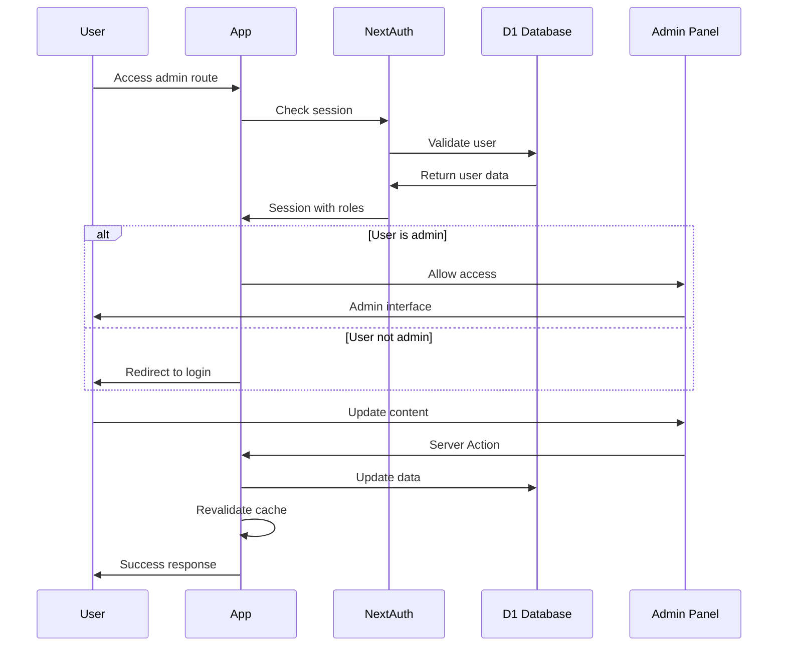

# Backend Architecture

## Serverless Function Architecture

### Function Organization

```
src/
├── lib/
│   ├── services/                    # Core business logic
│   │   ├── country-service.ts       # Country/destination operations
│   │   ├── visa-service.ts          # Visa eligibility calculations
│   │   ├── blog-service.ts          # Content management
│   │   └── cache-service.ts         # Multi-layer caching
│   ├── db/                          # Database layer
│   │   ├── connection.ts            # D1 connection setup
│   │   ├── schema/                  # Drizzle schema definitions
│   │   └── migrations/              # Database migrations
│   ├── utils/                       # Utility functions
│   │   ├── performance.ts           # Execution time monitoring
│   │   ├── cache-keys.ts            # Cache key generation
│   │   └── query-optimization.ts    # Single-query patterns
│   └── actions/                     # Server Actions
│       ├── destination-actions.ts   # Destination-related mutations
│       ├── contact-actions.ts       # Contact form processing
│       └── admin-actions.ts         # Content management
```

### Server Action Template (Performance-Optimized)

```typescript
// lib/actions/destination-actions.ts
"use server";

import { z } from "zod";
import { countryService } from "@/lib/services/country-service";
import { withPerformanceMonitoring } from "@/lib/utils/performance";
import { revalidateTag } from "next/cache";

const subscribeNewsletterSchema = z.object({
  email: z.string().email(),
  destination: z.string().optional(),
  locale: z.string().default("en"),
});

export const subscribeToNewsletter = withPerformanceMonitoring(
  "subscribeToNewsletter",
  async (formData: FormData) => {
    const startTime = performance.now();

    try {
      // Input validation (fast, happens first)
      const data = subscribeNewsletterSchema.parse({
        email: formData.get("email"),
        destination: formData.get("destination"),
        locale: formData.get("locale"),
      });

      // Single database operation
      await countryService.addNewsletterSubscription(data);

      // Optional: Track performance for monitoring
      const executionTime = performance.now() - startTime;
      if (executionTime > 30) {
        console.warn(`Slow Server Action: ${executionTime.toFixed(2)}ms`);
      }

      return { success: true, message: "Subscribed successfully" };
    } catch (error) {
      console.error("Newsletter subscription failed:", error);
      return { success: false, error: "Subscription failed" };
    }
  }
);
```

## Database Architecture

### Optimized Schema Design (Addressing Story 1.8 N+1 Issues)

```sql
-- Optimized indexes for single-query patterns
CREATE INDEX idx_countries_popular_lookup
ON countries(isActive, isPopular, deletedAt)
WHERE isActive = true AND deletedAt IS NULL;

CREATE INDEX idx_countries_i18n_locale_lookup
ON countriesI18n(countryId, locale);

CREATE INDEX idx_visa_types_destination_active
ON visaTypes(destinationId, isActive, deletedAt, fee, processingTime)
WHERE isActive = true AND deletedAt IS NULL;

CREATE INDEX idx_visa_eligibility_comprehensive
ON visaEligibility(passportCountryId, destinationId, eligibilityStatus, isActive)
WHERE isActive = true AND deletedAt IS NULL;

-- Materialized view for popular destinations (pre-computed)
CREATE VIEW popular_destinations_summary AS
SELECT
  c.id,
  c.code,
  c.name,
  c.heroImage,
  c.continent,
  c.isPopular,
  ci.name as localizedName,
  ci.about,
  COUNT(DISTINCT vt.id) as visaCount,
  ROUND(AVG(vt.processingTime)) as avgProcessingTime,
  MIN(vt.fee) as minFee,
  COUNT(DISTINCT CASE WHEN ve.eligibilityStatus IN ('visa_free', 'on_arrival')
    THEN ve.passportCountryId END) as visaFreeCountries
FROM countries c
LEFT JOIN countriesI18n ci ON c.id = ci.countryId
LEFT JOIN visaTypes vt ON c.id = vt.destinationId
  AND vt.isActive = true AND vt.deletedAt IS NULL
LEFT JOIN visaEligibility ve ON c.id = ve.destinationId
  AND ve.isActive = true AND ve.deletedAt IS NULL
WHERE c.isActive = true AND c.deletedAt IS NULL
GROUP BY c.id, c.code, c.name, c.heroImage, c.continent, c.isPopular, ci.name, ci.about;
```

### Data Access Layer (Single-Query Optimization)

```typescript
// lib/services/country-service.ts
import { db } from "@/lib/db/connection";
import {
  countries,
  countriesI18n,
  visaTypes,
  visaEligibility,
} from "@/lib/db/schema";
import { eq, and, desc, sql, count, avg, min } from "drizzle-orm";

export class CountryService {
  // Optimized single query for popular destinations
  async getPopularDestinations(locale: string): Promise<DestinationSummary[]> {
    const startTime = performance.now();

    try {
      // Single query with all needed data - eliminates N+1 pattern
      const results = await db
        .select({
          id: countries.id,
          code: countries.code,
          name: countries.name,
          localizedName: countriesI18n.name,
          heroImage: countries.heroImage,
          continent: countries.continent,
          isPopular: countries.isPopular,
          about: countriesI18n.about,
          // Aggregated visa information
          visaCount: count(visaTypes.id).as("visaCount"),
          avgProcessingTime:
            sql<number>`COALESCE(AVG(${visaTypes.processingTime}), 0)`.as(
              "avgProcessingTime"
            ),
          minFee: sql<number>`COALESCE(MIN(${visaTypes.fee}), 0)`.as("minFee"),
          // Visa-free options count
          visaFreeOptions:
            sql<number>`COUNT(CASE WHEN ${visaEligibility.eligibilityStatus} IN ('visa_free', 'on_arrival') THEN 1 END)`.as(
              "visaFreeOptions"
            ),
        })
        .from(countries)
        .leftJoin(
          countriesI18n,
          and(
            eq(countriesI18n.countryId, countries.id),
            eq(countriesI18n.locale, locale)
          )
        )
        .leftJoin(
          visaTypes,
          and(
            eq(visaTypes.destinationId, countries.id),
            eq(visaTypes.isActive, true),
            sql`${visaTypes.deletedAt} IS NULL`
          )
        )
        .leftJoin(
          visaEligibility,
          and(
            eq(visaEligibility.destinationId, countries.id),
            eq(visaEligibility.isActive, true),
            sql`${visaEligibility.deletedAt} IS NULL`
          )
        )
        .where(
          and(
            eq(countries.isActive, true),
            eq(countries.isPopular, true),
            sql`${countries.deletedAt} IS NULL`
          )
        )
        .groupBy(countries.id, countriesI18n.name, countriesI18n.about)
        .orderBy(desc(countries.popularityScore))
        .limit(8);

      const executionTime = performance.now() - startTime;

      // Performance monitoring for Story 1.8 compliance
      if (executionTime > 30) {
        console.warn(
          `Slow query detected: getPopularDestinations took ${executionTime.toFixed(2)}ms`
        );
      }

      return results.map(row => ({
        ...row,
        name: row.localizedName || row.name, // Fallback to English
        about: row.about || "", // Handle null descriptions
        executionTime: Math.round(executionTime),
      }));
    } catch (error) {
      console.error("Failed to fetch popular destinations:", error);
      throw new Error("Unable to load destinations");
    }
  }
}
```

## Authentication and Authorization

### Auth Flow



### Middleware/Guards

```typescript
// lib/auth/middleware.ts
import { auth } from "@/lib/auth";
import { NextResponse } from "next/server";

export async function authMiddleware(request: Request) {
  // Skip auth for public routes
  const publicRoutes = ["/", "/d", "/blog", "/contact"];
  const pathname = new URL(request.url).pathname;

  if (publicRoutes.some(route => pathname.startsWith(route))) {
    return NextResponse.next();
  }

  // Check authentication for protected routes
  const session = await auth();

  if (!session && pathname.startsWith("/admin")) {
    return NextResponse.redirect(new URL("/login", request.url));
  }

  // Check admin role for admin routes
  if (pathname.startsWith("/admin") && !session?.user?.isAdmin) {
    return NextResponse.redirect(new URL("/unauthorized", request.url));
  }

  return NextResponse.next();
}

// Performance monitoring middleware
export function withPerformanceMonitoring<T extends any[], R>(
  actionName: string,
  action: (...args: T) => Promise<R>
) {
  return async (...args: T): Promise<R> => {
    const startTime = performance.now();

    try {
      const result = await action(...args);
      const executionTime = performance.now() - startTime;

      // Log performance metrics
      console.log(`${actionName}: ${executionTime.toFixed(2)}ms`);

      // Alert if approaching Worker limits (Story 1.8)
      if (executionTime > 40) {
        console.warn(
          `Performance warning: ${actionName} took ${executionTime.toFixed(2)}ms (approaching 50ms limit)`
        );
      }

      return result;
    } catch (error) {
      const executionTime = performance.now() - startTime;
      console.error(
        `${actionName} failed after ${executionTime.toFixed(2)}ms:`,
        error
      );
      throw error;
    }
  };
}
```

---
