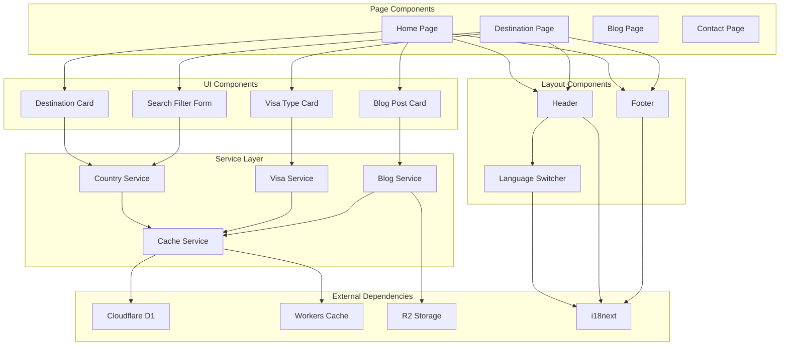

# Components

## Core Frontend Components

### DestinationCard

**Responsibility:** Display destination country information with visa summary and navigation links

**Key Interfaces:**

- `DestinationCardProps` - country data, visa count, popularity metrics
- `OnDestinationClick` - navigation handler for destination details

**Dependencies:** Country data model, flag utility, routing system

**Technology Stack:** React with TypeScript, shadcn/ui Card component, Tailwind CSS with RTL support

```typescript
interface DestinationCardProps {
  country: Country;
  visaCount: number;
  popularityScore?: number;
  passportCountry?: string;
  locale: string;
  className?: string;
}
```

### VisaTypeCard

**Responsibility:** Display individual visa type information with eligibility status and application details

**Key Interfaces:**

- `VisaTypeCardProps` - visa type data, eligibility, pricing
- `OnApplyClick` - application action handler

**Dependencies:** VisaType data model, eligibility service, currency formatting

**Technology Stack:** shadcn/ui components, dynamic pricing display, conditional rendering

### SearchFilterForm

**Responsibility:** Handle destination search and passport-based filtering with real-time results

**Key Interfaces:**

- `SearchFormProps` - initial values, callback handlers
- `OnSearchSubmit` - search query processing
- `OnFilterChange` - real-time filter updates

**Dependencies:** Country service, debounced search, form validation

**Technology Stack:** React Hook Form, shadcn/ui Select and Input components, Zod validation

### BlogPostCard

**Responsibility:** Display blog post previews with destination context and related visa information

**Key Interfaces:**

- `BlogPostCardProps` - post metadata, destination links
- `OnPostClick` - navigation to full post

**Dependencies:** BlogPost data model, image optimization, reading time calculation

**Technology Stack:** Next.js Image, database content rendering, date formatting utilities

## Layout Components

### Header

**Responsibility:** Global navigation with language switching, responsive menu, and search integration

**Key Interfaces:**

- `HeaderProps` - current locale, user preferences
- `LanguageSwitchHandler` - locale change processing
- `NavigationHandler` - route management

**Dependencies:** i18next, Next.js router, user session state

**Technology Stack:** shadcn/ui Navigation Menu, responsive design patterns, RTL layout support

### Footer

**Responsibility:** Site-wide footer with multi-column layout, legal links, and social media integration

**Key Interfaces:**

- `FooterProps` - locale, site configuration
- `SocialLinks` - external link management

**Dependencies:** Static content, social media URLs, legal page routing

**Technology Stack:** Responsive grid layout, external link handling, accessibility features

### LanguageSwitcher

**Responsibility:** Dropdown language selection with proper URL handling and state persistence

**Key Interfaces:**

- `LanguageSwitcherProps` - current locale, available languages
- `OnLanguageChange` - locale switching logic

**Dependencies:** Routing system, locale persistence, URL generation

**Technology Stack:** shadcn/ui Select, locale-aware routing, cookie management

## Service Layer Components

### CountryService

**Responsibility:** Database operations for country data, destination details, and popularity calculations

**Key Interfaces:**

- `getPopularDestinations()` - optimized query for homepage
- `getDestinationWithVisaOptions()` - detailed destination data
- `getAllDestinations()` - paginated country listing with filters

**Dependencies:** Drizzle ORM, D1 database connection, caching layer

**Technology Stack:** Single-query optimization, JOIN operations, performance monitoring

```typescript
class CountryService {
  async getPopularDestinations(locale: string): Promise<DestinationSummary[]> {
    // Single optimized query with JOINs to avoid N+1 pattern
    return await db
      .select({
        id: countries.id,
        code: countries.code,
        name: countriesI18n.name,
        heroImage: countries.heroImage,
        visaCount: sql<number>`count(distinct ${visaTypes.id})`,
        avgProcessingTime: sql<number>`avg(${visaTypes.processingTime})`,
        minFee: sql<number>`min(${visaTypes.fee})`,
      })
      .from(countries)
      .leftJoin(countriesI18n, eq(countriesI18n.countryId, countries.id))
      .leftJoin(visaTypes, eq(visaTypes.destinationId, countries.id))
      .where(
        and(
          eq(countries.isActive, true),
          eq(countries.isPopular, true),
          eq(countriesI18n.locale, locale)
        )
      )
      .groupBy(countries.id)
      .orderBy(desc(countries.popularityScore))
      .limit(8);
  }
}
```

### VisaService

**Responsibility:** Visa eligibility calculations, application requirements, and processing information

**Key Interfaces:**

- `checkEligibility()` - passport-destination visa requirements
- `getVisaTypeDetails()` - comprehensive visa information
- `calculateVisaFees()` - pricing with currency conversion

**Dependencies:** Database models, eligibility rules, external rate APIs

**Technology Stack:** Complex eligibility logic, fee calculations, requirement validation

### BlogService

**Responsibility:** Database content operations, destination-related posts, and tag-based filtering

**Key Interfaces:**

- `getBlogPosts()` - paginated post listing with filters from database
- `getBlogPost()` - individual post with metadata from database queries
- `getRelatedPosts()` - content recommendation engine via database relations

**Dependencies:** Drizzle ORM, database connections, content validation

**Technology Stack:** Database queries, JOIN operations, content caching, image optimization

## Performance-Critical Components

### CachedDestinationData

**Responsibility:** Aggressive caching wrapper for expensive destination queries

**Key Interfaces:**

- `getCachedData()` - cache-first data retrieval
- `invalidateCache()` - selective cache clearing

**Dependencies:** Cloudflare Workers Cache API, Next.js cache, revalidation triggers

**Technology Stack:** Multi-layer caching, TTL management, cache invalidation patterns

### OptimizedImageGallery

**Responsibility:** Destination image gallery with lazy loading and performance optimization

**Key Interfaces:**

- `ImageGalleryProps` - image URLs, alt text, optimization settings
- `OnImageLoad` - progressive loading handlers

**Dependencies:** Cloudflare Image Optimization, Next.js Image component

**Technology Stack:** WebP conversion, responsive images, lazy loading, blur placeholders

## Component Diagrams



---
