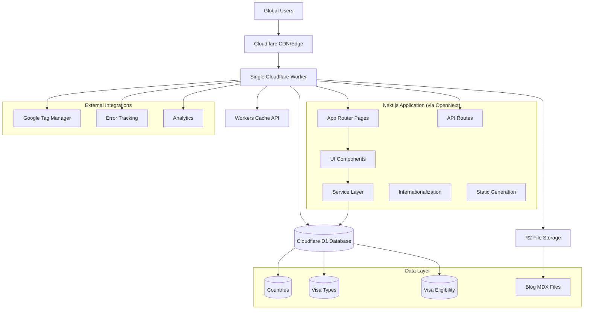

# High Level Architecture

## Technical Summary

GetTravelVisa.com employs a **serverless-first architecture** optimized for Cloudflare's edge computing platform, combining Next.js App Router with Cloudflare Workers for sub-50ms response times. The system integrates a **multilingual destination-driven catalog** with sophisticated visa eligibility matching, leveraging D1 SQLite for performant queries and Workers Cache API for aggressive optimization. The architecture prioritizes **single-query patterns** to eliminate N+1 database issues, ensuring consistent performance across 8 supported languages while maintaining RTL layout support. All components are designed for **edge-first deployment** via OpenNext.js, enabling global scale with Cloudflare's CDN infrastructure.

## Platform and Infrastructure Choice

**Platform:** Cloudflare Workers + Edge Infrastructure  
**Key Services:**

- Cloudflare Workers (compute)
- Cloudflare D1 (SQLite database)
- Cloudflare R2 (file storage)
- Cloudflare CDN (global distribution)
- Cloudflare Cache API (performance optimization)

**Deployment Host and Regions:** Global edge deployment via Cloudflare's 200+ data centers

## Repository Structure

**Structure:** Single Next.js application with modular organization  
**Monorepo Tool:** N/A - Single application repository  
**Package Organization:**

- Unified Next.js app with clear domain separation
- Service layer modules within `/lib/services/`
- Shared components in `/components/`
- Internationalization integrated throughout
- Database schema and utilities in `/lib/db/`

## High Level Architecture Diagram

## Architectural Patterns

- **Single Application Architecture:** Unified Next.js app deployed as one Cloudflare Worker - _Rationale:_ Simplifies deployment and reduces cold start overhead
- **OpenNext.js Deployment Pattern:** Transforms Next.js for Cloudflare Workers compatibility - _Rationale:_ Enables Next.js features while meeting Worker constraints
- **Edge-First Rendering:** All computation happens at Cloudflare edge - _Rationale:_ Addresses performance requirements and provides global scale
- **Single-Query Database Pattern:** Eliminate N+1 queries through JOIN operations - _Rationale:_ Critical for staying within Worker execution limits
- **Integrated Caching Strategy:** Workers Cache API + Next.js cache working together - _Rationale:_ Reduces database load and improves response times
- **Service Layer Pattern:** Clear separation between UI components and data access - _Rationale:_ Maintains clean architecture within single application

---
