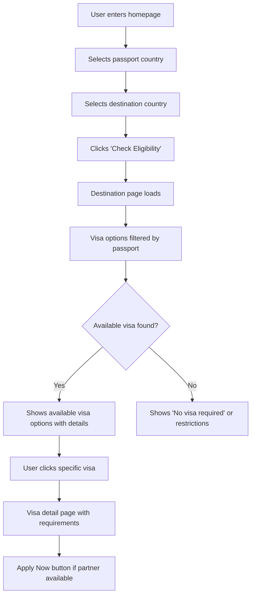
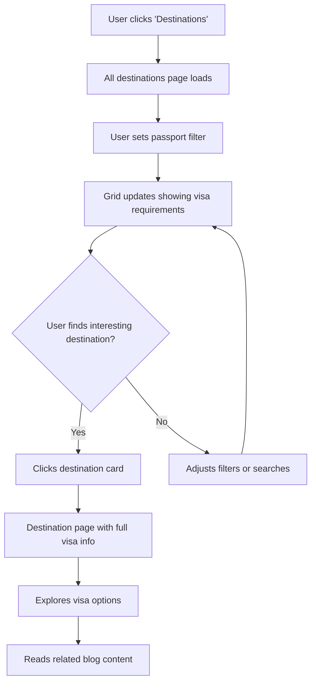

# GetTravelVisa.com UI/UX Specification

## Document Information

- **Version**: v1.0
- **Date**: September 2024
- **Author**: UX Expert Team
- **Status**: Active Development

---

## Introduction

This document defines the user experience goals, information architecture, user flows, and visual design specifications for GetTravelVisa.com's user interface. It serves as the foundation for visual design and frontend development, ensuring a cohesive and user-centered experience.

### Overall UX Goals & Principles

#### Target User Personas

- **International Travelers:** Individuals researching visa requirements before booking travel, often stressed about visa processes and needing clear, trustworthy information
- **Business Travelers:** Professionals requiring quick, accurate visa information for frequent travel
- **Travel Agents:** Consultants helping clients navigate visa requirements and application processes

#### Usability Goals

- **Ease of learning:** New users can check visa eligibility within 30 seconds
- **Efficiency of use:** Users can discover 3+ suitable destinations within 2 minutes
- **Error prevention:** Clear visual indicators for visa availability and requirements
- **Trust building:** Professional design that conveys reliability and expertise

#### Design Principles

1. **Clarity over cleverness** - Prioritize clear communication over aesthetic innovation
2. **Progressive disclosure** - Show only what's needed, when it's needed
3. **Consistent patterns** - Use familiar UI patterns throughout the application
4. **Immediate feedback** - Every action should have a clear, immediate response
5. **Accessible by default** - Design for all users from the start

### Change Log

| Date      | Version | Description                                               | Author         |
| --------- | ------- | --------------------------------------------------------- | -------------- |
| Sept 2024 | v1.0    | Initial frontend specification for unimplemented features | UX Expert Team |

---

## Information Architecture (IA)

### Site Map / Screen Inventory

```mermaid
graph TD
    A[Homepage] --> B[All Destinations /d/]
    A --> C[Blog /blog]
    A --> D[Contact /contact]

    B --> E[Individual Destination /d/{country}]
    E --> F[Visa Details /d/{country}/v/{visa}]
    E --> G[Passport Eligibility /d/{country}/p/{passport}]
    E --> H[Destination Blog /d/{country}/blog]

    C --> I[Blog Post /blog/{slug}]
    C --> J[Tag Filter /blog/t/{tag}]

    E --> K[Country Sitemap /d/{country}/sitemap.xml]
```

### Navigation Structure

**Primary Navigation:** Home, Destinations, Travel Blog, Contact

**Secondary Navigation:** Country filters, visa type filters, passport selection

**Breadcrumb Strategy:** Essential for deep destination/visa pages with clear hierarchy: Home > Destinations > {Country} > {Visa Type}

---

## User Flows

### Flow 1: Visa Eligibility Check Flow

**User Goal:** Check visa requirements for a specific destination with my passport

**Entry Points:**

- Homepage search form
- Direct destination page access
- "All Destinations" browsing

**Success Criteria:** User understands their visa options within 30 seconds

#### Flow Diagram



#### Edge Cases & Error Handling:

- No visa required (passport allows visa-free travel)
- Multiple visa types available with different requirements
- Affiliate partner unavailable for specific visa type
- Country data incomplete or unavailable

**Notes:** Core value proposition flow that leverages existing DestinationCard and VisaTypeCard components

### Flow 2: Destination Discovery Flow

**User Goal:** Explore visa-friendly destinations for my passport

**Entry Points:**

- Navigation "Destinations" link
- Homepage destination cards

**Success Criteria:** User discovers 3+ suitable destinations within 2 minutes

#### Flow Diagram



#### Edge Cases & Error Handling:

- No destinations found for passport filter
- Network errors during filtering
- Incomplete visa data for some destinations

**Notes:** Supports destination-driven approach with multiple entry points for different user behaviors

---

## Wireframes & Mockups

**Primary Design Files:** Continue using Next.js components as living documentation, with Figma wireframes for complex layouts

### Key Screen Layouts

#### All Destinations Listing Page (`/d/`)

**Purpose:** Help users discover and filter destinations based on visa requirements for their passport

**Key Elements:**

- Passport country selector (sticky header component)
- Search/filter bar with country name autocomplete
- Grid layout of destination cards (extending existing DestinationCard)
- Visa requirement indicators (visa-free, visa required, restrictions)
- Sort options (alphabetical, popularity, visa difficulty)

**Interaction Notes:** Real-time filtering without page reload, visual indicators for visa status, smooth transitions when filters change

#### Individual Destination Page (`/d/{country}`)

**Purpose:** Comprehensive visa information hub for a specific destination

**Key Elements:**

- Destination hero section with country image and key info
- Passport selector for personalized visa options
- Visa options grid (extending VisaTypeCard component)
- Related blog posts section
- Breadcrumb navigation

**Interaction Notes:** Passport selection updates visa options dynamically, "Apply Now" buttons appear only when affiliate partners available

#### Visa Detail Page (`/d/{country}/v/{visa}`)

**Purpose:** Complete visa application requirements and process information

**Key Elements:**

- Visa type overview with processing time and fees
- Requirements checklist with document specifications
- Step-by-step application process
- Partner application buttons with UTM tracking
- Related visa options for same destination

**Interaction Notes:** Interactive requirements checklist, clear visual hierarchy for scanning, prominent but not aggressive affiliate CTAs

---

## Component Library / Design System

**Design System Approach:** Build incrementally upon existing Tailwind CSS foundation with custom components, extending rather than rebuilding established patterns.

### Core Components

#### VisaEligibilityBadge

**Purpose:** Visual indicator of visa requirement status for passport holders

**Variants:** visa-free (green), visa-required (yellow), restricted (red), unknown (gray)

**States:** Default, hover, loading, error

**Usage Guidelines:** Always pair with explanatory text, use consistently across destination cards and detailed pages, ensure sufficient color contrast for accessibility

#### CountrySelector

**Purpose:** Passport country selection with search and autocomplete

**Variants:** compact (header/navigation), prominent (homepage/key interactions), inline (embedded forms)

**States:** Closed, open, searching, selected, error, disabled

**Usage Guidelines:** Include country flags when space permits, support keyboard navigation, handle RTL text direction properly

#### VisaRequirementsCard

**Purpose:** Detailed visa requirements display with interactive checklist

**Variants:** summary (high-level overview), detailed (complete requirements), comparison (side-by-side options)

**States:** Collapsed, expanded, loading, partner-available, partner-unavailable

**Usage Guidelines:** Use progressive disclosure to avoid overwhelming users, make affiliate CTAs prominent but not aggressive

#### AffiliatePartnerButton

**Purpose:** Call-to-action for visa application through partner services

**Variants:** primary (main application CTA), secondary (alternative partner), unavailable (disabled with explanation)

**States:** Default, hover, loading, success, error, disabled

**Usage Guidelines:** Only display when partner is available, open in new tab to preserve research session, include partner logos for trust

---

## Branding & Style Guide

### Visual Identity

**Brand Guidelines:** Building upon existing blue-to-indigo gradient theme with Cairo font family for international appeal

### Color Palette

| Color Type | Hex Code              | Usage                                     |
| ---------- | --------------------- | ----------------------------------------- |
| Primary    | #2563eb (blue-600)    | CTAs, links, brand elements               |
| Secondary  | #6366f1 (indigo-500)  | Secondary actions, accents                |
| Accent     | #3b82f6 (blue-500)    | Highlights, interactive elements          |
| Success    | #059669 (emerald-600) | Visa-free status, positive feedback       |
| Warning    | #d97706 (amber-600)   | Visa required status, important notices   |
| Error      | #dc2626 (red-600)     | Restrictions, errors, unavailable options |
| Neutral    | #374151 (gray-700)    | Primary text, headers                     |

### Typography

#### Font Families

- **Primary:** Cairo (multilingual support)
- **Secondary:** System fallbacks (-apple-system, BlinkMacSystemFont, "Segoe UI", "Roboto")
- **Monospace:** Consolas, Monaco, "Courier New"

#### Type Scale

| Element | Size            | Weight         | Line Height |
| ------- | --------------- | -------------- | ----------- |
| H1      | 3.75rem (60px)  | 700 (bold)     | 1.1         |
| H2      | 2.25rem (36px)  | 600 (semibold) | 1.2         |
| H3      | 1.5rem (24px)   | 600 (semibold) | 1.3         |
| Body    | 1rem (16px)     | 400 (normal)   | 1.6         |
| Small   | 0.875rem (14px) | 400 (normal)   | 1.5         |

### Iconography

**Icon Library:** Heroicons (consistent with Tailwind ecosystem)

**Usage Guidelines:** Outline style for interactive elements, solid style for status indicators, consistent 24px size for primary actions

### Spacing & Layout

**Grid System:** Tailwind's default 12-column grid with max-width constraints

**Spacing Scale:** Tailwind's 4px base scale (4, 8, 12, 16, 20, 24, 32, 40, 48, 64px)

---

## Accessibility Requirements

### Compliance Target

**Standard:** WCAG 2.1 AA

### Key Requirements

**Visual:**

- Color contrast ratios: 4.5:1 for normal text, 3:1 for large text
- Focus indicators: 2px solid blue ring with 2px offset, visible on all interactive elements
- Text sizing: Support up to 200% zoom without horizontal scrolling

**Interaction:**

- Keyboard navigation: Full functionality accessible via keyboard with logical tab order
- Screen reader support: Semantic HTML, ARIA labels for complex interactions, live regions for dynamic content
- Touch targets: Minimum 44px × 44px for all interactive elements

**Content:**

- Alternative text: Descriptive alt text for country flags and destination images
- Heading structure: Logical H1-H6 hierarchy, single H1 per page, no skipped levels
- Form labels: Explicit labels for all form inputs, error messages associated with fields

### Testing Strategy

Automated testing with axe-core, manual keyboard navigation testing, screen reader testing with NVDA/JAWS/VoiceOver, color contrast validation for all UI states

---

## Responsiveness Strategy

### Breakpoints

| Breakpoint | Min Width | Max Width | Target Devices                               |
| ---------- | --------- | --------- | -------------------------------------------- |
| Mobile     | 320px     | 767px     | Smartphones, travel research on-the-go       |
| Tablet     | 768px     | 1023px    | iPads, travel planning sessions              |
| Desktop    | 1024px    | 1439px    | Laptops, detailed visa research              |
| Wide       | 1440px    | -         | Large monitors, multi-destination comparison |

### Adaptation Patterns

**Layout Changes:** Single column layouts on mobile, 2-column on tablet, 3-4 column grids on desktop

**Navigation Changes:** Hamburger menu on mobile, hybrid navigation on tablet, full horizontal navigation on desktop

**Content Priority:** Essential visa info first on mobile, balanced overview on tablet, comprehensive display on desktop

**Interaction Changes:** Touch-optimized controls on mobile, hybrid touch/mouse on tablet, hover states and keyboard shortcuts on desktop

---

## Animation & Micro-interactions

### Motion Principles

Purposeful motion serving functional purposes, performance-first approach (60fps), respectful of accessibility preferences, culturally sensitive for international users

### Key Animations

- **DestinationCard Hover:** Subtle scale transform (scale: 1.05) with shadow enhancement (Duration: 200ms, Easing: ease-out)
- **Visa Eligibility Badge:** Color transition when passport selection changes (Duration: 300ms, Easing: ease-in-out)
- **Search Results Loading:** Skeleton animation for destination cards (Duration: 1.5s, Easing: linear, infinite)
- **Filter Application:** Smooth height transition for collapsing/expanding filter panels (Duration: 250ms, Easing: ease-in-out)
- **Page Transitions:** Subtle fade-in for new content sections (Duration: 400ms, Easing: ease-out)
- **CTA Button States:** Gentle bounce on hover for affiliate "Apply Now" buttons (Duration: 150ms, Easing: ease-out)

---

## Performance Considerations

### Performance Goals

- **Page Load:** <3 seconds for destination pages
- **Interaction Response:** <200ms for filter applications and search suggestions
- **Animation FPS:** Consistent 60fps for all micro-interactions

### Design Strategies

Progressive image loading with lazy loading for destination images, smart caching for visa eligibility data, optimistic UI for immediate user feedback, skeleton screens matching final content layout, critical resource prioritization

---

## Next Steps

### Immediate Actions

1. Create high-fidelity wireframes for the three key screen layouts
2. Develop component specifications with Tailwind CSS classes
3. Set up development environment with TypeScript interfaces
4. Implement core VisaEligibilityBadge component as foundation
5. Create accessibility testing checklist specific to visa platform

### Design Handoff Checklist

- ✅ All user flows documented
- ✅ Component inventory complete
- ✅ Accessibility requirements defined
- ✅ Responsive strategy clear
- ✅ Brand guidelines incorporated
- ✅ Performance goals established

---

_This specification covers the unimplemented features from the GetTravelVisa.com PRD, building upon the existing homepage foundation to create a comprehensive destination-driven visa catalog platform._
